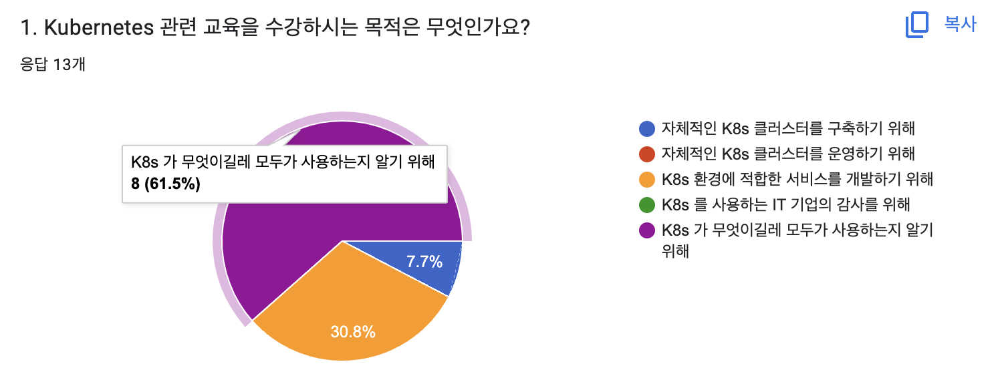
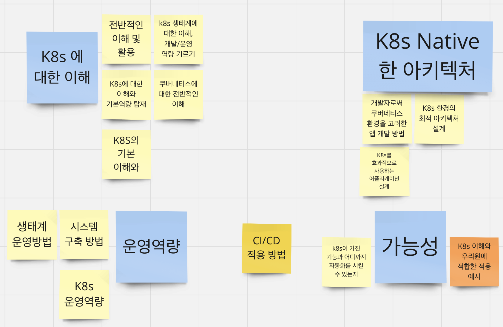
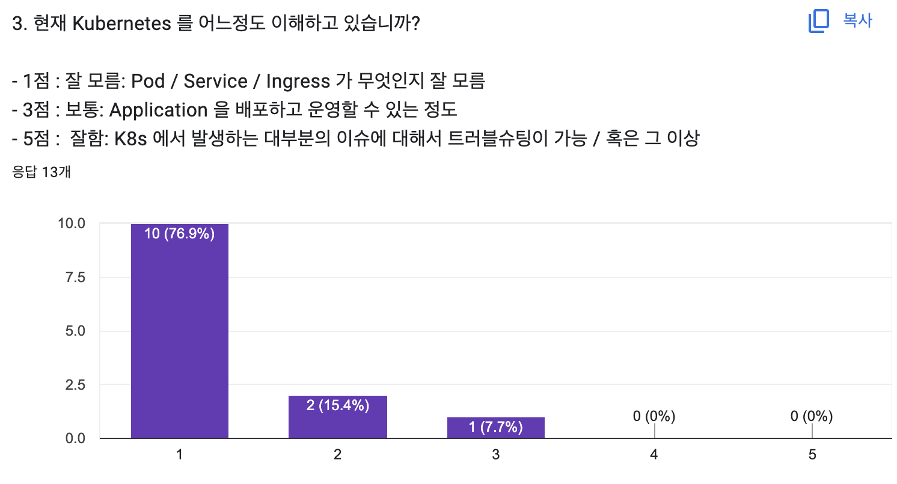

# Intro

#### Kubernetes for 금융결제원

---

# Who am I

- Preferred to be called **Cloud Software Engineer**
  - Not DevOps / Site Reliability Engineer
  - Not Backend / Frontend Software Engineer
  - Not System Engineer
  - Engineer for Engineers
- Chequer / Cloud Developer
- (Prev) Pagecall / General Software Engineer
- (Prev) Kakao / Cloud Engineer

---

---

2. Kubernetes 교육을 통해서 무엇을 얻어가고 싶으신가요?

---

---

# 강의 목표

### 1일차: 감잡기

### 2일차: 이해하기

### 3일차: 확장하기

---

# 강의 목표

### 1일차: 감잡기

- K8s는 무엇인지?
- 왜 쓰는지?
- 어떻게 쓰는지?
- 어떻게들 쓰고있는지?

---

# 강의 목표

### 2일차: 이해하기

- K8s 설계 사상 (Controller Pattern)
- K8s 주요 컴포넌트
- API: K8s 인증 / 인가
- API: 확장 (Custom Resource)
- K8s Interfaces - 1차

---

# 강의 목표

### 3일차: 확장하기

- K8s Interfaces - 2차
- CNCF 란?
- CI / CD / 로그 / 메트릭
- 실전 트러블슈팅

---

# Notice

- 1일 7시간
- 40분 수업 / 10분 질문 / 10분 쉬는시간
