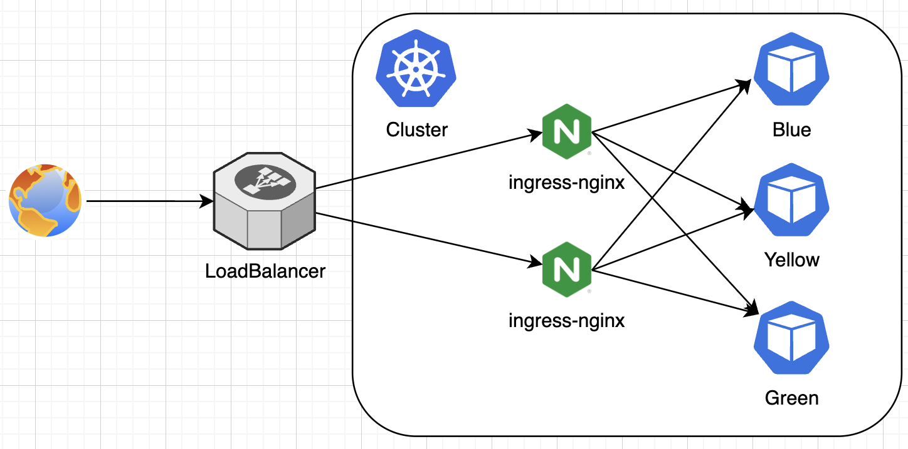
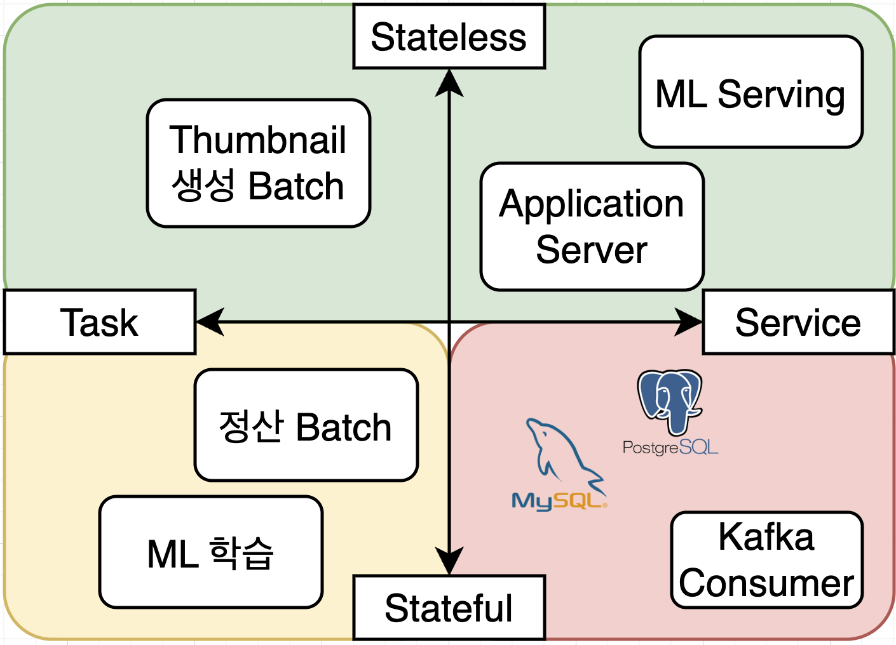

# 1일차: 감잡기

#### Kubernetes for 금융결제원

---

```
- (09:00~11:00) 쿠버네티스란 무엇일까?
  - 쿠버네티스를 왜 쓰는것일까?
  - 쿠버네티스 이전의 세상
- (13:00~16:00) 쿠버네티스는 어떻게 쓰는것일까?
  - 접속방법 (11:00~11:30)
  - Pod 란? (13:00~)
  - ReplicaSet? Deployment?
  - Service 란?
  - Ingress 란? (~16:00)
- (16:00~17:00) 쿠버네티스를 어떻게들 쓰고 있을까?
```

---

## 쿠버네티스란 무엇일까?

---

## Q. 쿠버네티스를 한문장으로 정의해보세요

---

## Q. 쿠버네티스를 한문장으로 정의해보세요

(컨테이너 오케스트레이터 빼고)

---

## A. 리소스 매니저

리소스 = 텍스트로 표현 가능한 모든것

---

## A. 리소스 매니저

리소스 = 텍스트로 표현 가능한 모든것

리소스 매니저?

---

## 리소스 매니저 - 사람에 비유

일일히 누가 뭘 어떻게 해야하는지 관리해야한다.

```
Before: 카카오톡으로 업무지시

카카오페이에 API 하나 열어줘야하는데
- A씨는 개발은 어떻게하고
- B씨는 방화벽 신청은 이거 어디가서 어떻게 열어주고
- C씨는 누구랑 협조요청하고
- D씨는 ... (이하생략)

누가 무엇을 어떻게 수행 지시
```

---

## 리소스 매니저 - 사람에 비유

리소스를 선언하면 나머지는 알아서들 잘 한다.

```
After: 프로젝트 세부 스펙 공지

카카오페이에 API 하나 열어줘야하는데
- 어떤 기능의 API에 대해서
- TCP 몇번 포트 쓰고
- 누구를 통해서 뭘 하고
- (이하생략)

=> PDF 파일로 전 직원에게 공유, 직원들이 알아서 수행

무엇을 수행 지시
```

---

## 리소스 매니저 - 현실에 비유

```
Before: SSH 로 접속해서 일일히 수행

- x.x.x.x 서버는 마스터노드 담당하고
- x.x.x.x 서버는 워커노드 담당하고
- x.x.x.x 서버는 Bastion 으로 쓰고
- x.x.x.x 서버는 Audit 로그 쌓아두고
(등등)
```

---

## 리소스 매니저 - 현실에 비유

```
After: 그냥 뭐가 필요한지 작성

- 마스터노드는 2대 필요하고
- 워커노드는 200대 필요하고
- Bastion 서버는 2대 필요하고
- Audit 로그는 어디다 쌓고

- 서버 100대 있으니깐 알아서 써, 부족하면 말하고

(등등)
```

---

## 쿠버네티스의 핵심은

1. 리소스를 선언만 하면 나머지는 알아서 관리하는 하나의 플랫폼이라는 것
2. 그 리소스의 종류는 사용자 마음대로 확장이 가능하다는 것
3. 단지 이런식으로 설명하면 말이 많아지고 복잡해지고 쉽게 납득이 안가니깐 `컨테이너 오케스트레이션` 을 대표 기능으로 표방하는 것 일뿐...

---

## Q. 근데 왜 이것에 다들 환호하는 것일까요?

---

## A. 쿠버네티스 이전의 역사

https://drive.google.com/file/d/1UWc58RmA7oU4j3OfhAJSIjAo0IoMhiWC/view?usp=sharing

---

## A. 근데 왜 이것에 다들 환호하는 것일까요?

```
0. 기존것들과 비교했을때
   => SSH, Ansbile, Puppet, OpenStack, AWS EC2...
1. 일관된 작동을 보장하니깐
   => Docker
2. 클러스터를 관리하는데 편하니깐
   => Mesos (DCOS), Docker Swarm
3. 요구사항에 맞게 확장까지 되니깐 (Database, Stroage, Network, etc...)
   => Kubernetes
4. 남들이 만들어둔 확장 로직을 가져와서 쓸 수 있으니깐 (CI/CD, Logs, Metrics, etc...)
   => Kubernetes
5. 심지어 생태계도 크니깐 (CNCF)
   => Kubernetes
```

---

# 쿠버네티스는 어떻게 쓰는것일까?

- kubectl
- BlueGreen App 배포해보기
  - Pod
  - Service
  - Ingress
- 애플리케이션의 성격 고민해보기
  - Deployment / DaemonSet / StatefulSet

---

## 접속하기

1. kubectl 다운로드
   [https://kubernetes.io/docs/tasks/tools/install-kubectl-linux/](https://kubernetes.io/docs/tasks/tools/install-kubectl-linux/)

2. Kubernetes 접속정보 입력

---

> vim `~/.kube/config`

```
apiVersion: v1
clusters:
- cluster:
    server: https://kubegang.today
  name: kubegang
contexts:
- context:
    cluster: kubegang
    user: kubegang
    namespace: default
  name: kubegang
current-context: kubegang
kind: Config
users:
- name: kubegang
  user:
    token: helloworldpassword
```

---

# 실습 목표



---

## Pod?

Kubernetes 에서 가장 자주 마주치게 되는 개념

- 1개 이상의 컨테이너를 묶어놓은 정의를 하나의 Pod 이라고 표현
- K8s 상에서 돌아가는 가장 작은 개념의 Workload
- `kubectl get pod -A` 로 현재 Kubernetes 상에 존재하는 모든 Pod 들을 확인가능
- 개념적으로는 Docker Container 와 Virtual Machine 사이에 존재

---

# Pod 비교

<div class="grid grid-cols-3 gap-4">
<div>

### 도커 컨테이너

하나의 도커 컨테이너는

- 하나의 프로세스
- 하나의 IP 주소
- 하나의 FS

</div>
<div>

### Pod

하나의 Pod 는

- 수개의 격리된 프로세스
- 하나의 IP 주소
- 수개의 공유가능한 FS

</div>
<div>

### 가상머신

하나의 가상머신은

- 수십개의 공유된 프로세스
- 하나의 IP 주소
- 하나의 FS

</div>
</div>

> 참고: FS: File System

---

# Pod: 사이드카 컨테이너

- 일반적인 사용 패턴은
  - 주 목적인 메인 컨테이너를 중심으로
    (API 서버 / Batch Job 등등)
  - 메인 컨테이너를 서포트하는 `사이드카 컨테이너`
    (로그 수집 / 메트릭 수집 / Proxy 서버 등등)
- 를 하나의 Pod 안에서 같이 구동

- 필요한경우 사용할 수는 있으나
  대체로 하나의 Pod 에 하나의 Container 만 실행시키는 것이 운영적으로 편함

> 참고: `메인 컨테이너`라는 표현은 공식적인 표현은 아님

---

# Pod: 사이드카 컨테이너 잘 활용한 케이스

- ML Serving:
  - API 서버 컨테이너는 로컬 디스크의 ML 모델을 활용해 추론만 진행
  - Model Puller 컨테이너는 주기적으로 ML 모델을 다운로드해서 로컬 디스크에 저장
- Istio:
  - MSA 환경에서 API 서버 컨테이너는 평범하게 다른 서버를 호출
  - Istio 컨테이너는 이 요청을 가로채서 암호화부터 시작해 각종 모니터링을 진행

---

# Pod: 사이드카 컨테이너 잘 활용한 케이스

- Audit Log:
  - Audit 이벤트가 발생하면 로컬 디스크에 이벤트를 저장
  - Fluentd 와 같은 도구가 주기적으로 이 이벤트를 Splunk 에 전송

성격이 다른 두 유형의 작업을 하나의 어플리케이션에서 **코드 변경 없이** 수행하고 싶을때 자주 활용

---

# Pod 를 실행하는 법

`kubectl run -it --rm test --image alpine:latest -- sh`

- `-it`: 키보드 입력을 받을 수 있도록 실행
- `--rm`: 사용이 종료되면 자동으로 Pod 삭제
- `test`: Pod 의 이름
- `--image alpine:latest`: 사용할 Container Image 의 이름
- `--`: 이 이후는 kubectl 에서 사용하는것이 아니라 컨테이너에서 사용할 명령어임을 명시
- `sh`: `alpine:latest` 컨테이너 안에서 실행 할 명령어

---

# Pod 의 단점

- 한번 실행하면 변경을 못함 (manifest)
  - 다른 노드에서 실행되도록 변경 못함
  - 환경변수 변경 못함
  - 설정 변경 못함
- 두개이상 띄우기 불편함
  - HA 생각하면 최소 2개 이상은 항상 실행되어야함
  - 하나의 클러스터에서 Pod 이름은 중복되면 안됨

---

# Pod 의 단점

- 한번 실행하면 변경을 못함 (manifest)
  => 배포 전략과 관련된 문제
- 두개이상 띄우기 불편함
  => 스케일 아웃과 관련된 문제

---

# Pod 의 단점

- 한번 실행하면 변경을 못함 (manifest)
  => 배포 전략과 관련된 문제
  => `Deployment` 로 해결
- 두개이상 띄우기 불편함
  => 스케일 아웃과 관련된 문제
  => `Deployment` / `ReplicaSet` 으로 해결

---

# ReplicaSet

- Pod 스펙과 관련된 Template 을 선언하면
- 해당 Template 에 맞는 Pod 를
- 명시한 개수만큼 클러스터에 존재하게 하는것을 보장

- ReplicaSet Controller 라는 존재가
- ReplicaSet 정의를 보고 Pod 개수를 맞춰줌

---

```yaml
apiVersion: v1
kind: ReplicaSet
metadata:
  name: myapp
spec:
  replicas: 99
  selector:
    matchLabels:
      app: myapp
  template:
    metadata:
      name: myapp
      labels:
        app: myapp
    spec:
      containers:
        - name: myapp
          image: alpine:latest
```

---

```yaml
apiVersion: v1
kind: ReplicaSet
metadata:
  name: myapp # ReplicaSet 의 이름
spec:
  replicas: 99 # 복제할 Pod 개수
  selector:
    matchLabels:
      app: myapp # Pod 가 몇개 생성되었는지 세는 기준
  template: # Pod Template 에 대한 정의
    metadata:
      name: myapp # 무의미
      labels:
        app: myapp # 생성될 Pod 에 달릴 라벨
    spec:
      containers:
        - name: myapp
          image: alpine:latest
```

---

# ReplicaSet: 장점

- 간단하고 직관적이다.

# ReplicaSet: 단점

- `selctor` 에 해당하는 Pod 가 개수만큼만 확인되면 나머지는 신경 안쓴다.
  - Template 이 실제 일치하건 말건 신경 안쓴다.

---

# 왜 써요?

- 초창기에는 별 생각안하고 이정도면 충분할것이라고 생각하고 만듦
- 그러다가 더 고급 배포 기법에 대한 요구사항이 생기기 시작했고
- Deployment 가 나오면서 ReplicaSet 은 잘 안쓰게 됨

- 현재 ReplicaSet 은
  - BlueGreen / Canary / 특수상황 대응 등의 배포를 자동화
- 해주는 Tool (=컨트롤러) 들에서 많이 사용됨

---

# 그럼 뭐써요?

- 사람입장에서 가장 자주 사용하는건
  - Deployment

---

# Deployment

ReplicaSet 이 Pod 을 관리해주는 리소스라면

Deployment 는 ReplicaSet 을 관리해주는 리소스

---

# Deployment

ReplicaSet 이 Pod 의 개수만 추가적으로 명시했다면

Deployment 는 `어떻게 배포할 것인지?` 에 대한 내용도 추가적으로 명시

---

```yaml
apiVersion: apps/v1
kind: Deployment
metadata:
  name: myapp
spec:
  replicas: 99
  selector:
    matchLabels:
      app: myapp
  template:
    metadata:
      labels:
        app: myapp
    spec:
      containers:
        - name: myapp
          image: alpine:latest
```

---

```yaml
apiVersion: v1
kind: ReplicaSet
metadata:
  name: myapp
spec:
  replicas: 99
  selector:
    matchLabels:
      app: myapp
  template:
    metadata:
      name: myapp
      labels:
        app: myapp
    spec:
      containers:
        - name: myapp
          image: alpine:latest
```

---

# Deployment vs ReplicaSet

- 기본 설정은 ReplicaSet 과 Deployment 가 거의 유사
- 하지만 다음과 같은 설정들이 추가될 수 있음

---

# Deployment

```yaml
# 중복 생략
spec:
  replicas: 99
  selector:
    matchLabels:
      app: myapp
  progressDeadlineSeconds: 600
  revisionHistoryLimit: 10
  strategy:
    rollingUpdate:
      maxSurge: 25%
      maxUnavailable: 25%
    type: RollingUpdate
  template:
# 중복 생략
```

---

# Deployment

```yaml
# 중복 생략
spec:
  replicas: 99
  selector:
    matchLabels:
      app: myapp
  progressDeadlineSeconds: 600 # 5분안에 배포 성공 못하면 실패했다고 기록 / 실패해도 배포는 계속 시도함
  revisionHistoryLimit: 10 # (기록용으로) ReplicaSet 을 몇개까지 남겨둘 것인지
  strategy: # 배포 전략
    rollingUpdate: # 롤링 업데이트
      maxSurge: 25% # spec.replicas 개수보다 최대 몇개 더 존재해도 괜찮은지
      maxUnavailable: 25% # spec.replicas 개수보다 최대 몇개 더 사라져도 괜찮은지
    type: RollingUpdate
  template:
# 중복 생략
```

---

# Deployment: 쉽게 하는법

`kubectl create deployment myapp --image alpine:latest --replicas 99`

---

# 어디에 무슨설정이 있는지 어떻게 알죠?

1. 공식 가이드 `Kubernetes Documentation`
2. 공식 Reference 문서 `Kubernetes API Reference Docs`
3. Swagger `kubectl proxy`
4. 코드 분석 `https://github.com/kubernetes/kubernetes/`

번외. 편의성 툴

---

# Q. 서버를 배포했으면 해야하는것?

---

# Q. 서버를 배포했으면 해야하는것?

A. Loadbalancer 생성

---

# Q. 로드밸런서란?

A.

---

# Kubernetes 와 로드밸런서

- 일반적으로 서비스를 외부에 노출하기 위해서 두가지 종류의 로드밸런서가 사용됨

1. L4 LB
2. L7 LB

---

# Kubernetes 와 로드밸런서

- 일반적으로 서비스를 외부에 노출하기 위해서 두가지 종류의 로드밸런서가 사용됨

1. L4 LB - TCP / UDP 까지만 인지할 수 있는 로드밸런서
2. L7 LB - HTTP / Kafka / AMQP 등의 프로토콜까지 인지할 수 있는 로드밸런서

---

# Kubernetes 와 로드밸런서

- 일반적으로 서비스를 외부에 노출하기 위해서 두가지 종류의 로드밸런서가 사용됨

1. L4 LB -> Kubernetes Service
2. L7 LB -> Kubernetes Ingress

---

# Kubernetes 와 로드밸런서

- 일반적으로 서비스를 외부에 노출하기 위해서 두가지 종류의 로드밸런서가 사용됨

1. L4 LB -> Kubernetes Service
2. L7 LB -> Kubernetes Ingress

---

# Service

- Service 에는 여러가지 Type 이 존재

```
ClusterIP:    Cluster 내부에서만 유효한 IP 주소를 가진 L4 LB
LoadBalancer: Cluster 외부에서도 유효한 IP 주소를 가진 L4 LB
NodePort:     LoadBalancer 를 못쓸때 사용하는 기능
              모든 노드에서 ClusterIP 로 포트포워딩을 수행
ExternalName: DNS, CNAME 레코드 조작
```

- Headless Services
  - DNS 기반 로드밸런싱
  - `spec.clusterIP` 를 명시적으로 지우면 활성화

---

```yaml
apiVersion: v1
kind: Service
metadata:
  name: controlplane
  namespace: lecture
spec:
  clusterIP: 10.43.8.95
  clusterIPs:
    - 10.43.8.95
  internalTrafficPolicy: Cluster
  ipFamilies:
    - IPv4
  ipFamilyPolicy: SingleStack
  ports:
    - port: 6443
      protocol: TCP
      targetPort: 6443
  selector:
    app: controlplane
  sessionAffinity: None
  type: ClusterIP
status:
  loadBalancer: {}
```

---

# L4 LB 를 설정할때 필요한 정보는?

1.
2.
3.

---

# L4 LB 를 설정할때 필요한 정보는?

1. 무슨 프로토콜을 사용하는지 (TCP? UDP?)
2. 몇번 포트를 Listen 해야하는지 (80? 443?)
3. 로드밸런서에 소속된 멤버 접속 정보 (IP, Port)

---

# 최소 설정

```yaml
apiVersion: v1
kind: Service
metadata:
  name: controlplane
  namespace: lecture
spec:
  ports:
    - port: 6443 # 2. 몇번 포트를 Listen 해야하는지
      protocol: TCP # 1. 무슨 프로토콜
      targetPort: 6443 # 3. 멤버 포트 접속정보
  selector:
    app: controlplane # 3. 멤버 정보
  type: ClusterIP
```

---

# Kubernetes 와 로드밸런서

- 일반적으로 서비스를 외부에 노출하기 위해서 두가지 종류의 로드밸런서가 사용됨

1. L4 LB -> Kubernetes Service
2. L7 LB -> Kubernetes Ingress

---

# Ingress

- L4 LB 는 단순하고 강력하지만 한계도 명확
  - IP 랑 Port 의 개수는 유한함
  - 새로운거 하나 오픈할때마다 방화벽을 오픈할수는 없음
    - https://some.url:8443
    - 이런걸 공식 url 로 사용하기도 묘함
- 어차피 오늘날 대부분의 외부 노출 통신은 http 기반
  - http 는 http header 부분에 상당히 많은 정보가 담겨있음
  - 이 header 를 보고서 routing 을 해주는 LB 가 있다면?
    => L7 LB => Ingress

---

```yaml
apiVersion: networking.k8s.io/v1
kind: Ingress
metadata:
  annotations:
    cert-manager.io/cluster-issuer: letsencrypt
    nginx.ingress.kubernetes.io/backend-protocol: https
  name: controlplane
  namespace: lecture
spec:
  ingressClassName: nginx
  rules:
    - host: kubegang.today
      http:
        paths:
          - backend:
              service:
                name: controlplane
                port:
                  number: 6443
            path: /
            pathType: Prefix
  tls:
    - hosts:
        - kubegang.today
      secretName: kube-tls
```

---

# 실습: Blue Green App 배포해보기

https://github.com/iwanhae/simple-loadtester

---

# 쿠버네티스를 어떻게들 쓰고 있을까?

---

# 쿠버네티스를 어떻게들 쓰고 있을까?

주제

1. One Big Cluester / Small Many Clusters
2. Per Region / Federated / Edge
3. Kubernetes as a Service Platform
4. Kubernetes as a "Infrastructure as Code"

---



---

# 숙제

- DaemonSet
- StatefulSet

에대해서 인터넷으로 한번 찾아보고 오세요
