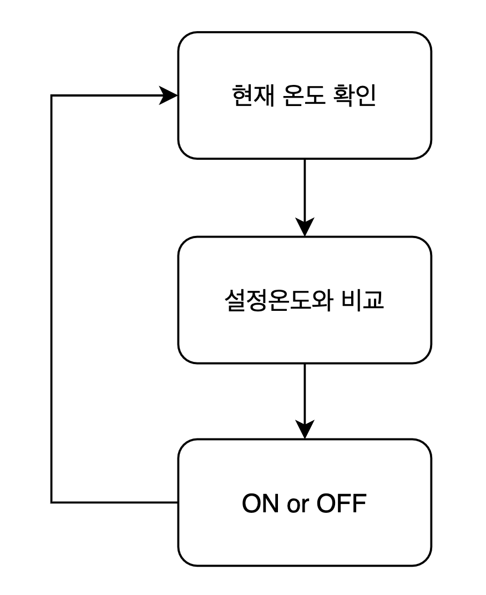
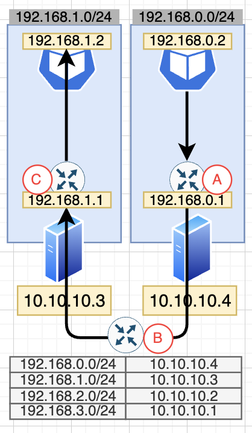

# 2일차: 이해하기

#### Kubernetes for 금융결제원

---

```
- [New][3교시] 싱글노드 Kubernetes 배포
- [1교시] Kubernetes 구성요소 - 1
  - etcd
  - kube-apiserver
  - kubelet
  - kube-scheduler
  - kube-proxy
- [2교시] Kubernetes 구성요소 - 2 + Controller 란?
  - kube-controller-manager
  - cloud-controller-manager
- [IGNORE][4, 5교시] Kubernetes 인증 / 인가 / Admission Controller
- [New][4, 5 교시] Kubernetes 무중단 배포 해보기
- [6교시] 네트워크 or StatefulSet/DaemonSet/ConfigMap/Secret
```

---

<!--1시간-->

# 실습: 싱글노드 Kubernetes 배포

---

접속정보: https://docs.google.com/spreadsheets/d/1R3R_ol5lExWJ7k0RjKcVTIGl56QrQBFpWgLKWh6FTh0/edit?usp=sharing

접속키: https://drive.google.com/file/d/1UgLHdmFq9zsxmcGPCoMdt7mGgH4yKzP1/view?usp=sharing

---

```bash
# Kubernetes Network
cat <<EOF | tee /etc/modules-load.d/k8s.conf
overlay
br_netfilter
EOF

cat <<EOF | tee /etc/sysctl.d/k8s.conf
net.bridge.bridge-nf-call-iptables  = 1
net.bridge.bridge-nf-call-ip6tables = 1
net.ipv4.ip_forward                 = 1
EOF

# kubeadm, kubelet, kubectl
apt-get update
apt-get install -y apt-transport-https ca-certificates curl
curl -fsSL https://packages.cloud.google.com/apt/doc/apt-key.gpg\
 | gpg --dearmor -o /etc/apt/keyrings/kubernetes-archive-keyring.gpg
echo "deb [signed-by=/etc/apt/keyrings/kubernetes-archive-keyring.gpg] https://apt.kubernetes.io/ kubernetes-xenial main"\
 | tee /etc/apt/sources.list.d/kubernetes.list
apt-get update
apt-get install -y kubelet kubeadm kubectl
apt-mark hold kubelet kubeadm kubectl

# Containerd
apt-get install -y containerd
cat <<EOF | tee /etc/crictl.yaml
runtime-endpoint: unix:///run/containerd/containerd.sock
image-endpoint: unix:///run/containerd/containerd.sock
EOF
mkdir /etc/containerd
containerd config default | tee /etc/containerd/config.toml
sed -i 's/            SystemdCgroup = false/            SystemdCgroup = true/' /etc/containerd/config.toml
```

---

```bash
kubeadm init --pod-network-cidr 10.244.0.0/16

mkdir -p $HOME/.kube
cp -i /etc/kubernetes/admin.conf $HOME/.kube/config

kubectl apply -f https://github.com/flannel-io/flannel/releases/latest/download/kube-flannel.yml
```

---

# 실습: 로컬에서 kubectl 실행할 수 있게 세팅하기

---

# 왜 로컬로 옮기면 작동이 안되죠?

---

# 어떻게 하면 될까요?

---

# 데모: kubectl 명령어 보기

---

<!--1시간-->

# Kubernetes 구성요소

- etcd
- kube-apiserver
- kubelet
- kube-scheduler
- kube-proxy

---

## Overview


---

## etcd

- Kubernetes 전체 구성에서 유일하게 Stateful 한 컴포넌트
- Kubernetes 상의 모든 정보를 저장하는
  NoSQL DB / Key Value DB / CP System
- Kubernetes 가 무제한 확장을 하는데 거의 유일한 병목지점
  SSD 의 성능에 큰 영향을 받고, 노드 규모가 1,000 대를 넘어가기 시작하면 관심이 필요
- 기본적으로 Redis 의 GET, SET, MONITOR 에 해당하는 기능들만 주로 활용

---

# etcd

- etcd 는
  Consistency, Availability, Partition Tolerance (CAP) Theorem 에서
  CP 를 추구하는 시스템
- 무슨일이 있어도 작동이 안할지언정 Split Brain 현상은 발생하지 않음
  (= 노드간 서로 다른 데이터를 들고있을 가능성이 없음)
- 대신 고가용성을 희생하였고 `Quorum` 이라는 제약이 존재
  - `⌊총 노드개수 / 2⌋ + 1` 개 이상의 노드가 살아있을때만 쓰기 가능
  - 노드개수가 3개라면, 2개 이상이 살아있어야하고, 1개의 장애 허용
  - 노드개수가 5개라면, 3개 이상이 살아있어야하고, 2개의 장애 허용

---

# etcd

- Kubernetes Controlplane 노드를 구성할때 1개, 3개, 5개 로 구성하는
  유일한 이유
- 이러한 제한에서 벗어나기위해 [etcd API 호환성만 맞추고 etcd 를 사용 안하는 케이스](https://github.com/k3s-io/kine)도 다수 존재
  - 어느정도 다운타임을 허용하는경우 etcd 대신 MySQL 같은 DB 를 사용
- 혹은 하나의 etcd 클러스터를 다수의 K8s 클러스터들이 공유해서 사용
  - 클러스터별로 Controlplane 노드 관리 수요를 확 줄임
- 그럼에도 불구하고 상당히 안정적인 시스템이기 때문에 널리 사용되고
  별 문제는 잘 안생김

---

## kube-apiserver


---

# kube-apiserver

- etcd 를 DB 로 활용하는 API 서버
- HTTP 를 사용하며 `JSON`/`YAML`/`Protobuf`/`SPDY` 등으로 통신
- 기본적으로 Kubernetes 모든 컴포넌트들은 `kube-apiserver` 와 통신
- 기본적으로 선언형으로 API 가 설계되어있으며 이를 Resource 라고 표현함
- 가끔 선언형으로 관리 못하는 액션들은 Subresource 형태로 API 를 표현함
  - `kubectl exec` `kubectl port-forward` `kubectl attach` 등등...

---

# kube-apiserver

- 주요 책임은 `리소스를 관리` 하는것
- 클라이언트 요청이 들어가면
  - Rate Limiting
  - Authentication
  - Authorization
  - Validation
  - Defaulting
- 등의 과정을 거쳐 etcd 에 저장하거나 데이터를 읽어옮

---

# kubelet


---

# kubelet

- kube-apiserver 와 통신해서 Pod 선언을 지켜보고 있다가
- 자신이 관리하는 노드에 배정된 Pod 를 보면
- Container Runtime Interface (CRI) 를 통해서
  - ~~Docker~~, Containerd, CRI-O, Kata Containers, gVisor
- 등의 Container Runtime 들을 이용해서 실제 컨테이너를 실행

---

# kubelet

- `자신이 관리하는 노드에 배정된 Pod 를 보면`
  -> 누가?

---

# kube-scheduler

- `자신이 관리하는 노드에 배정된 Pod 를 보면`
  -> kube-scheduler

---

# kube-scheduler

- Deployment 를 선언했다.
- Pod 가 많이 만들어졌다.
  - 하지만 `spec.nodeName` 필드는 비어져 있다.
- 이것을 채워주는것이 `kube-scheduler` 의 역할

---

# kube-scheduler

- 두 가지 타입에 해당하는 다양한 플러그인(=알고리즘) 에 의해서 결정
  - `Filtering`
    Taint, TCP Port, GPU Device, PV 가용 노드, Pod IP 주소 등을 고려
    애초에 배포가 불가능한 노드를 제외하는 플러그인들
  - `Scoring`
    CPU, Memory Requests, Pod 배포 선호도, 네트워크 토폴로지등을 고려
    어느 노드에 배포되는것을 더 선호되는지 계산하는 플러그인들
- 원한다면 특정 Filtering 이나 Scoring 플러그인을 비활성화 하던가 가중치를 줄 수 있으나, 대체로는 건드릴 일 없음

---

# kube-proxy

- Service ClusterIP 를 통해서 실제 다른 Pod 들과 통신이 가능
- 하지만 어떻게?

---

# kube-proxy

- Service ClusterIP 를 통해서 실제 다른 Pod 들과 통신이 가능
- 초창기에는
  - ClusterIP 를 dst 로 가지는 패킷을
  - tcpdump 와 같은 원리로 낚아채서
  - HAProxy 나 Nginx 처럼 작동

---

# kube-proxy

- Service ClusterIP 를 통해서 실제 다른 Pod 들과 통신이 가능
- 초창기에는
  - ClusterIP 를 dst 로 가지는 패킷을
  - tcpdump 와 같은 원리로 낚아채서
  - HAProxy 나 Nginx 처럼 작동
- 요즘은
  - IPVS 라는 리눅스 커널단의 SW LB 를 활용

---

# kube-proxy

- Service ClusterIP 를 통해서 실제 다른 Pod 들과 통신이 가능
- 초창기에는
  - ClusterIP 를 dst 로 가지는 패킷을
  - tcpdump 와 같은 원리로 낚아채서
  - HAProxy 나 Nginx 처럼 작동
- 요즘은
  - IPVS 라는 리눅스 커널단의 SW LB 를 활용
- 혹은
  - eBPF 를 사용해서 더 효율적으로 작동 (=Cilium)

---

# Q&A

---

<!--1시간 30분-->

# Kubernetes 구성요소 + Controller 란?

- controller란?
- kube-controller-manager
- cloud-controller-manager

---

# Controller 란?

---

Gaming **Controller**


---

Micro **Controller**


---

Spring **Controller**


---

# Q. 컨트롤러에 대해서 정의를 내려봅시다

---

# Q. 선언형 API 와 명령형 API 의 차이점은 무엇인가요?

---

# 선언형 API 란?

기본적인 컨셉은

1. 내가 원하는 상태를 선언한다.
2. 시스템은 내가 원하는 상태로 맞춰준다.

- [Docker](https://docs.docker.com/engine/api/v1.43/) > 명령형
- [Kubernetes](https://s3.iwanhae.kr/public/k8s/index.html) > 선언형

---

## 어떻게 "시스템은 내가 원하는 상태로 맞춰"줄까?

-> Controller Pattern

---

# 에어컨 컨트롤러

- Closed Loop System
- 기계공학에서는 허구한날 쓰는 용어
- 기계공학의 개념을 CS에서 빌림



---

# K8s Controller

[link](https://github.com/kubernetes/community/blob/master/contributors/devel/sig-api-machinery/controllers.md)

```go
for {
  desired := getDesiredState()
  current := getCurrentState()
  makeChanges(desired, current)
}
```

---

# 물론 현실은 저렇게 간단하진 않음 - 1

[link](https://cloudark.medium.com/kubernetes-custom-controllers-b6c7d0668fdf)

- 네트워크 트래픽을 줄이기위한 캐싱
- 동시성 이슈를 처리하기위한 큐잉
- 코드 재사용성을 위한 복잡한 아키텍처
- kube-apiserver 부하를 낮추기 위한 각종 기믹들
- 각종 예외상황 처리


---

# 물론 현실은 저렇게 간단하진 않음 - 2

- `kubectl get leases.coordination.k8s.io`
- 동시간에 하나의 리소스를 조작하는건 최대 1개의 컨트롤러가 되게하기위한 lease api

---

# 그래도 기본은

[link](https://github.com/kubernetes/community/blob/master/contributors/devel/sig-api-machinery/controllers.md)

```go
for {
  desired := getDesiredState()
  current := getCurrentState()
  makeChanges(desired, current)
}
```

---

K8s 의 **거의 대부분의** 요소는 기본적으로 컨트롤러 패턴을 따름

- `kubelet`:
  Pod 의 desiredState 보고 CRI 를 통해 컨테이너의 Current State 가 Desired State 와 같게 노력
- `kube-proxy`:
  Service 의 desiredState 를 보고 IPTables 와 IPVS 를 조작해 Current State 가 (이하생략)
- `cloud-controller-manager`:
  Node, Loadbalancer 등의 desiredState 보고 CSP API 찔러서 Current (이하생략)
- `kube-controller-manager`:
  위와 같은 컨트롤러가 40개 넘게 돌아가는 컴포넌트

---

# Q&A

---

# kube-controller-manager

- 대충 40개가 넘어가는 컨트롤러들을 하나의 바이너리로 묶은 컴포넌트
- 문자 그대로의 의미로 우리가 쓰는 모든 K8s 에 기대되는 액션은 kube-controller-manager 가 해주는것
- 근데 문서화 안되어있음 자세히 알려면 코드를 뜯어보는 방법밖에...
- [맛보기 😎](https://github.com/kubernetes/kubernetes/tree/v1.28.4/cmd/kube-controller-manager/app)
  - clusterroleaggregation
  - apps/v1 Deployment

---

# Deployment

- [OpenShift](https://github.com/kubernetes/kubernetes/issues/1743#issuecomment-91431450) 에서 만들어진 개념이 K8s 에 적용된 사례
- K8s 에서 가장 일상적으로 많이 사용되는 리소스
- Deployment > ReplicaSet > Pod
- ReplicaSet 과 별도로 존재하는 이유:
  - ReplicaSet 은 숫자 유지에 초점을 둠
  - Deployment 는 숫자 조절에 초점을 둠

---

# Deployment 질문

Q. 노드 3개에 Replicas 가 99로 설정된 Deployment를 배포하면
`kube-controller-manager` 는 Pod 을 어떤 노드에 할당할까?

Q. ReadWriteOnce 특징을 가진 PV를 Deployment로 관리하면 어떻게 될까?

Q. Elasticsearch, etcd, ZooKeeper 를 Deployment 로 관리하기 까다로운 이유?

---

# StatefulSet

- 본래 이름은 PetSet (Q. Pet의 반대되는 개념은?)
- 3개의 문제 제기에서 시작 [Link](https://github.com/kubernetes/kubernetes/issues/260)
- 3가지 특징
  1. 개별 Pod 을 특정하기 쉽게 네이밍
  2. 개별 Pod 과 연결하기 쉽게 DNS 주소 부여
  3. PVC 관리같이해줌

---

# DaemonSet

- 로그수집하거나 하나의 노드에 하나의 서버만 띄우는 (HDFS) 요구사항으로 나온 컨셉 [link](https://github.com/kubernetes/kubernetes/issues/1518)
- 실제 Production에서 의외로 StatefulSet 과 고민하는 경우가 종종 있음
- 로그 & 메트릭 / 네트워킹 / 스토리지 에이전트 용도로 자주 사용
- `kube-proxy` 또한 DaemonSet

---

# Controller Pattern 의 좋은점?

---

# Ingress 의 사례

- [어디에도](https://github.com/kubernetes/kubernetes/tree/v1.28.4/cmd/kube-controller-manager/app) Ingress 관련된 내용은 없음
- 하지만 실제 Ingress 는 잘 작동했었음

- 누가 Ingress 리소스를 보고서 우리가 원하는대로 설정을 해주는 것일까?

---

# ingress-nginx-controller

[link](https://github.com/kubernetes/ingress-nginx)

- Ingress 리소스를 지켜보고 있다가
- 변화가 생기면
- `nginx.conf` 파일을 새로 생성한뒤
- `nginx -s reload` 명령어를 대신 수행해줌

---

# HAProxy Kubernetes Ingress Controller

- Ingress 리소스를 지켜보고 있다가
- 변화가 생기면
- `HAProxy` 설정을 적당히 변경해줌

---

# aws-load-balancer-controller

- Ingress 리소스를 지켜보고 있다가
- 변화가 생기면
- AWS ALB API 를 적당히 찔러줌

---

# ingress-gce

- Ingress 리소스를 지켜보고 있다가
- 변화가 생기면
- GCP L7 LB API 를 적당히 찔러줌

---

# Ingress

- 서로다른 인프라 형상과 요구사항에 의해서 언제든 부족함이 발생함
- K8s 는 이걸 혼자서 해결하려고 안함
- Ingress 라는 Resource 를 매개로, 실제 작업은 Controller 가 수행
- 관리자는 자기 상황에 맞는 컨트롤러를
  - 구현하던가
  - 설치하던가

---

# 리소스

만약 `Ingress` 가 아닌 다른것이 필요하다면?

---

# 커스텀 리소스

만약 `Ingress` 가 아닌 다른것이 필요하다면?
=> `Custom Resource Definition` (이하 `CRD`)

---

# 커스텀 리소스

만약 `Ingress` 가 아닌 다른것이 필요하다면?
=> `Custom Resource Definition` (이하 `CRD`)
=> 자신이 원하는 리소스를 사용할 수 있도록 `선언` 해주는 `리소스`

---

# 커스텀 리소스

만약 `Ingress` 가 아닌 다른것이 필요하다면?
=> `Custom Resource Definition` (이하 `CRD`)
=> 자신이 원하는 리소스를 사용할 수 있도록 `선언` 해주는 `리소스`

=> `CRD` 를 `선언` 하면 새로운 리소스 (=`Custom Resource`) 를 사용할 수 있다.

---

# 커스텀 리소스

- ElasticSearch 를 자동으로 운영하는 컨트롤러
- 네트워크 방화벽을 자동으로 설정해주는 컨트롤러
- TLS 인증서를 자동으로 발급받아주는 컨트롤러
- 헬름차트를 대신 배포해주는 컨트롤러
- AWS 상 리소스를 대신 관리해주는 컨트롤러
- 자동으로 메트릭 수집해주는 컨트롤러
- 등등등...

---

# cloud-controller-manager

- Ingress 처럼 K8s 와 기본으로 같이 오는 리소스임에도 불구하고
- K8s 가 로직을 구현을 안한것들이 존재

---

# cloud-controller-manager

- Ingress 처럼 K8s 와 기본으로 같이 오는 리소스임에도 불구하고
- K8s 가 로직을 구현을 안한것들이 존재
  - Service, LoadBalancer
  - Persistent Volume (Claim)
  - NetworkPolicy

---

# cloud-controller-manager

- Ingress 처럼 K8s 와 기본으로 같이 오는 리소스임에도 불구하고
- K8s 가 로직을 구현을 안한것들이 존재
  - Service, LoadBalancer => `cloud-controller-manager`
  - Persistent Volume (Claim)
  - NetworkPolicy

[링크](https://github.com/kubernetes/cloud-provider/blob/master/cloud.go#L42-L69)

---

# Q&A

---

# 다시 한번 해봅시다 😎

https://github.com/iwanhae/simple-loadtester

---

# 왜 안되죠?

---

https://k3s.io/

```
kubeadm reset
curl -sfL https://get.k3s.io | sh -
```

---

# 실습 PDF 로 이동

---

<!--2시간-->

# Kubernetes 인증 / 인가 / Admission Controller

- 인증
- 인가
- Admission Controller (ADC)

---

# Q. 인증과 인가의 정의

---

# 인증

- 내가 "누구"인지 알아내는것

# 인가

- "누구"가 이걸 할 수 있는지 알아내는것

인증 + 인가 = 내가 이걸 할 수 있는지 알아내는것

---

# K8s 에서 인증과 인가

K8s 에서 인증과 인가에 대한 인터페이스는 간단함

```go
// 인증
type Request interface {
	AuthenticateRequest(req *http.Request) (*Response, bool, error)
}
// Response 의 내용물
type user.Info interface {
    GetName() string
    GetGroups() []string
    GetUID() string // 동일한 Name 구분용이긴 한데, audit 이외에 잘 활용 X
    GetExtra() map[string][]string // 특수한케이스에서 사용
}
```

---

# K8s 에서 인증과 인가

K8s 에서 인증과 인가에 대한 인터페이스는 간단함

```go
// 인가
type Authorizer interface {
	Authorize(ctx context.Context, a Attributes) (authorized Decision, reason string, err error)
}

type Attributes interface {
    // User Group | GVK Namespace Name Subresource | Verb
}

type Decision int

const (
	DecisionDeny Decision = iota
	DecisionAllow
	DecisionNoOpinion
)
```

---

# Kubernetes 에서 인증 구현체

- X509 Client Certs
- Static Token File
- Bootstrap Tokens
- Service Account Tokens
- OpenID Connect Tokens
- Webhook Token Authentication
- Authenticating Proxy

---

- X509 Client Certs > x509 인증서에서 `CN` 과 `O` 필드만 확인
- Static Token File > kube-apiserver 노드에 CSV 형태로 파일 저장
- Bootstrap Tokens > 새로운 노드 추가할때 사용
- Service Account Tokens > K8s Pod 에서 API 접근할때 주로 사용
  `system:serviceaccounts` 그룹
  `system:serviceaccount:(NAMESPACE):(SERVICEACCOUNT)` 유저
- OpenID Connect Tokens > OAuth 호환.
  JWT 에서 `sub` 와 `groups` 필드만 확인
- Webhook Token Authentication > 외부 인증 서버에 웹훅방식으로 질의
- Authenticating Proxy > Proxy 서버에서의 요청에서 `X-Remote-User` `X-Remote-Group` 확인

---

# Demo

```
curl -k \
 --cert /etc/kubernetes/pki/front-proxy-client.crt \
 --key /etc/kubernetes/pki/front-proxy-client.key \
 -H "X-Remote-Group: system:masters" \
 -H "X-Remote-User: help" \
 https://127.0.0.1:6443/apis

```

---

# Kubernetes 인증

다양한 방식이 존재하지만 결론은

HTTP 요청에서 아래 정보 알아내기

```go
// 인증
type Request interface {
	AuthenticateRequest(req *http.Request) (*Response, bool, error)
}
// Response 의 내용물
type user.Info interface {
    GetName() string
    GetGroups() []string
    GetUID() string // 동일한 Name 구분용이긴 한데, audit 이외에 잘 활용 X
    GetExtra() map[string][]string // 특수한케이스에서 사용
}
```

---

# Kubernetes 에서 인가 Interface

```go
// 인가
type Authorizer interface {
	Authorize(ctx context.Context, a Attributes) (authorized Decision, reason string, err error)
}

type Attributes interface {
    // User Group | GVK Namespace Name Subresource | Verb
}

type Decision int

const (
	DecisionDeny Decision = iota
	DecisionAllow
	DecisionNoOpinion
)
```

---

# Kubernetes 에서 인가 구현체

- ABAC
- RBAC
- Node
- Webhook
- Always Allow
- Always Deny

---

# Kubernetes 에서 인가 구현체

- ABAC > deprecated
- RBAC > 보통 많이 보는것
- Node > kubelet 을 위한 인가방식 그래프방식으로 인가 데이터를 관리
- Webhook > 외부 서버에 웹훅 방식으로 인가여부를 판단
- Always Allow
- Always Deny

---

# Kubernetes 인가

다양한 방식이 존재하지만 결론은

HTTP 요청에서

```go
type Decision int

const (
	DecisionDeny Decision = iota
	DecisionAllow
	DecisionNoOpinion
)
```

위 정보 알아내기

---

# Q&A

---

# Kubernetes RBAC Scope

K8s 에서 RBAC 은 2가지 Scope 가 존재

1. ClusterRole / ClusterRoleBinding:
   클러스터 내부의 모든 리소스에 대해서 유효
   `/apis/${GroupVersion}/${kind}`
2. Role / RoleBinding
   해당 리소스가 선언된 Namespace 내부에서만 유효
   `/apis/${GroupVersion}/namespaces/${namespace}/${kind}`

---

# Demo

ClusterRole 리소스 보기 [src](https://github.com/kubernetes/kubernetes/blob/v1.28.0-alpha.4/pkg/apis/rbac/types.go#L43-L63)

1. `kubectl get clusterrole system:kube-scheduler -o json | jq`
2. `kubectl get clusterrole system:auth-delegator -o json | jq`

---

# Admission Controller


---

# Admission Controller

- https://kubernetes.io/docs/reference/access-authn-authz/admission-controllers/
- Validating Admission Webhook
- Mutating Admission Webhook

---

# Admission Controller

- 세부 보안요건 충족
- 용으로 쓰라고 만들었지만....

---

# Admission Controller

- Human Error 방지 (=> ingress-nginx)
- 단순 작업 자동화 (=> Istio)
- 등으로 더 많이 활용

---

<!--1시간-->

# Kubernetes Networking

---

# Q&A

---

# Overview

<div class="grid grid-cols-2 gap-4">
<div>

### Overlay 방식


</div>
<div>

### Native Routing 방식



</div>
</div>

---

# 장단점

<div class="grid grid-cols-2 gap-4">
<div>

### Overlay 방식 장점

- 네트워크 인프라에 대한 소유권이 없어도 어디서든 사용 가능하다.
  - 사설 IP 주소를 마음껏 활용 할 수 있다.
- 패킷이 암호화 할 수 있어 보안적으로 더 안전할 수 있다.

</div>
<div>

### Native Routing 방식 단점

- 네트워크 라우터에 대한 설정권한이 없으면 사용하기 힘들다.
- 클러스터 내부 외부 구분없이 모든 통신은 네트워크 전역에서 유효해 방화벽 정책에 대해서 고민해봐야 한다.

</div>
</div>

---

# 장단점

<div class="grid grid-cols-2 gap-4">
<div>

### Overlay 방식 단점

- 네트워크 처리에 대한 CPU, Memory 오버헤드가 크다
- 네트워크 구성이 복잡해진다.
  (=이슈 발생시 원인분석이 까다롭다.)
- 클러스터 외부와 내부가 격리되어있어 LoadBalancer 나 NodePort 와 같은 방식을 고민해봐야 한다.

</div>
<div>

### Native Routing 방식 장점

- 매우 빠르다.
- 트러블슈팅이 비교적 쉽다
- 클러스터 외부에서 자연스럽게 클러스터 내부에 접근이 가능하다.

</div>
</div>

---

# Q&A
