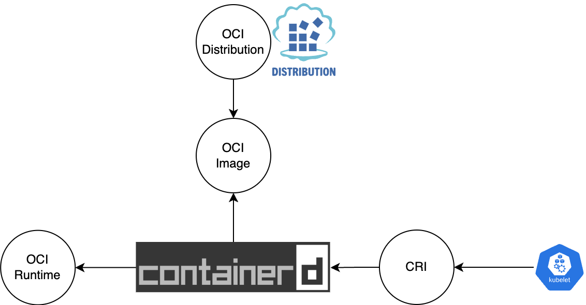
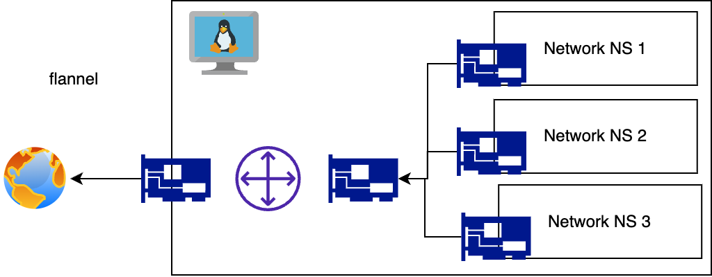

# 3일차: 확장하기

#### Kubernetes for 금융결제원

---

```
- [1,2교시] Kubernetes 그리고 인터페이스
  - OCI: Docker? Containerd? CRI-O?
  - CRI: Container Runtime Interface
  - CNI: Cilium? Calico? Flannel?
  - CSI: Persistent Volume?
  - CPI: Loadbalancer?
- [3교시] CI/CD
  - 책임의 분리: CI 와 CD
  - Kubernetes 에서 CD 란?
  - Jenkins, ArgoCD, Helm
- [4,5교시] Logging, Metrics
  - Log 파이프라인 아키텍처
  - OpenMetrics
- [6교시] Recap
```

---

# Q. 컨테이너란?

---

# DEMO

프로그래밍

---

# DEMO

```
# Dockerfile

FROM alpine as src
FROM alpine
COPY --from=src / /mnt
```

```
# demo.bash

docker build -t test .
mkdir -p tmp
docker run -it --rm -v $(pwd)/tmp:/host test cp -r /mnt/. /host
```

```
chroot tmp
```

---

# Q. Interface 란?

---

## 무엇을 인터페이스라고 부르나요?

### 다음 셋을 하나로 묶어 부르는 명칭은?

1. 키보드
2. 마우스
3. 조이스틱

---

## 무엇을 인터페이스라고 부르나요?

### 다음 셋을 하나로 묶어 부르는 명칭은?

1. 키보드
2. 마우스
3. 조이스틱

## **Human interface device (HID)**

---

## 다음의 정식 명칭은?

## 

---

## 다음의 정식 명칭은?


## **Network Interface Controller (Card)**

---

## 다음 코드들의 역할은?

https://chat.openai.com/share/e9b335ea-b23e-49f9-9a31-ea5009817ed3

---

# 인터페이스란 무엇인가요?

두 개체 또는 시스템 사이의 상호 작용을 가능하게 하는 공통의 경계 또는 연결점에 대한 규약 혹은 계약.

---

# 쿠버네티스에게 인터페이스란?

1. https://github.com/kubernetes/kubernetes/
   는 데이터상으로 리소스를 관리하는 거대한 프로젝트

   API > 선언형으로 리소스를 저장하고 구독하는 클라이언트들을 대상으로 알려줌
   Controller > 선언된 리소스를 보고 리소스를 생성하거나 조작함

---

# 쿠버네티스에게 인터페이스란?

2. 리소스를 보고 실제 행동을 취하는것은 철저하게 외주화
   CRI > 컨테이너 생성 외주
   CSI > 스토리지 생성 외주
   CNI > 네트워크 생성 외주
   CPI > 로드밸런서 생성 (+기타등등) 외주

---

# 쿠버네티스에게 인터페이스란?

1. 외주를 주려면 표준 작업계약이 필요하다.
2. 인터페이스는 두 개체 또는 시스템 사이의 상호 작용을 가능하게 하는 공통의 경계 또는 연결점에 대한 규약 혹은 계약이다.

-> 외주는 인터페이스에 맞게 줄것이다.

---

# 쿠버네티스에게 인터페이스란?

쿠버네티스 내부에서도 코드적으로 상당히 많은 인터페이스가 사용되고 있지만

e.g, 인증 / 인가 / 클라이언트 / 서버 등등...

쿠버네티스가 쿠버네티스 외부와 직접적으로 소통할때도 자주사용되는 몇몇개는 표준 인터페이스가 존재
(보통은 컨트롤러가 외부 시스템과 직접적으로 소통)

---

# 쿠버네티스에게 인터페이스란?

쿠버네티스와 연관된 인터페이스 표준 만드는 두 곳

1. Open Container Initiative
   쿠버네티스가 직접적으로 여기서 재정한 표준을 사용하지는 않지만
   모든 컨테이너는 이 표준에 맞게 생성되고, 실행되고, 관리됨 (Docker, Containerd, CRI-O 가 사용)

2. Cloud Native Computing Foundation
   Linux Foundation 산하 기관.
   쿠버네티스는 여기서 만들고 쿠버네티스가 직접적으로 사용하는 인터페이스도 여기서 정의

---

# Q&A

---

## Container Runtime Interface (CRI)

그리고

## Open Container Initiative (OCI)

---

# Open Container Initiative (OCI) 란?

- 컨테이너에 대한 표준 규약을 만들기 위해 시작된 "프로젝트"
- Linux Foundation 을 주축으로 우리가 아는 대부분의 기업이 멤버로 참여
- Docker에서 사용한 스펙을 베이스로 개선사항이 포함되어 있음

---

# 컨테이너를 실행한다는 것은?

(`docker run nginx` 했을 때 발생하는 일은?)

---

# 컨테이너를 실행한다는 것은?

(`docker run nginx` 했을 때 발생하는 일은?)

1. Registry에서 컨테이너 이미지를 다운로드한다는 것

---

# 컨테이너를 실행한다는 것은?

(`docker run nginx` 했을 때 발생하는 일은?)

1. Registry에서 컨테이너 이미지를 다운로드한다는 것
2. 다운로드한 이미지를 로컬 어딘가에 파일 시스템으로 만든다는 것

---

# 컨테이너를 실행한다는 것은?

(`docker run nginx` 했을 때 발생하는 일은?)

1. Registry에서 컨테이너 이미지를 다운로드한다는 것
2. 다운로드한 이미지를 로컬 어딘가에 파일 시스템으로 만든다는 것
3. 파일시스템을 기반으로 특정 프로세스를 실행한다는 것

---

# OCI Interface

딱 3개의 Spec 을 발표
https://specs.opencontainers.org/

- Runtime Spec
- Image Spec
- Dustribution Spec

---

# Runtime Spec

로컬에서 컨테이너를 어떻게

- 만들고
- 모니터링하고
- 관리하고
- 삭제

할 것인지에 대한 스펙. (단, 어떻게 만들지는 제약이 없다. WASM, VM, Container 무엇을 사용해도 규격에는 적합)

---

# Image Spec

- Image Spec 은 Runtime Spec 에서 사용하는 RootFS 을
  - 어떻게 저장하고
  - 어떻게 사용하는지
- 에 대한 내용들이 기술
- 구버전 Docker 이미지와 호환성 이슈가 있는 경우가 존재해서 뭔가 예상대로 돌아가지 않는다면
  - OCI 스펙인지 or Docker 스펙인지
    확인필요

---

# Distribution Spec

- 존재하는 이미지를 어떻게 배포할것인지에 대한 스펙
- 앞서 보았던 내용을 HTTP 기반의 API 로 배포하는 방법에 대해 기술
- https://specs.opencontainers.org/distribution-spec/?v=v1.0.0
- 다행스럽게도 스펙 그 자체에 대해서는 잘 몰라도 크게 지장은 없으나...

---

# !Distribution Spec

- Distribution Spec 에서 다루는 내용은 제한적. 세부적인 구현 방법에 대해서는 열려있음
- 구현체에따라 실제 트래픽이 어떻게 달라질 수 있고
- 인증과 인가에 대해서는 신경써두면 좋음

---

# DEMO

```bash
# Auth
export TOKEN=\
"$(curl --silent --header 'GET' "https://auth.docker.io/token?service=registry.docker.io&scope=repository:library/ubuntu:pull" | jq -r '.token' )"

# !Standard?
curl https://registry.hub.docker.com/v2/repositories/library/ubuntu/tags/latest

# Index
curl -H "Authorization: Bearer $TOKEN" -H "Accept: application/vnd.oci.image.index.v1+json"\
      https://registry.hub.docker.com/v2/library/ubuntu/manifests/latest

# Manifest
curl -H "Authorization: Bearer $TOKEN" -H "Accept: application/vnd.oci.image.manifest.v1+json"\
      https://registry.hub.docker.com/v2/library/ubuntu/manifests/sha256:b0b966f885ea29d809d03d027c3d21182676380b241c3a271aa83f8e9d7bac06 | jq

# Blobs
curl -H "Authorization: Bearer $TOKEN"\
      https://registry.hub.docker.com/v2/library/ubuntu/blobs/sha256:8591eece70e54e483b384ce950218057ea0af677115b02a041579bf05da474ec

# https://www.cloudflare.com/ko-kr/case-studies/docker/
```

---

# Q&A

---

# 인증 / 인가

- 기본적으로 Authorzation Header 기반 Token 인증
- 아래 설정이 실질적인 표준처럼 적용됨.
  - https://github.com/containers/image/blob/main/docs/containers-auth.json.5.md
- **다만 이 토큰을 어떻게 얻는지는 방법이 다양**
- https://github.com/distribution/distribution/blob/main/docs/spec/auth/index.md

---

# OCI Interface

딱 3개의 Spec 을 발표
https://specs.opencontainers.org/

- Runtime Spec
- Image Spec
- Dustribution Spec

---

# OCI Interface

하지만 이것은 컨테이너를 어떻게 실행시킬지에 대한 표준.

Kubernetes 와 상관없이 범용적인 이야기

---

# OCI 에서 정의한 스펙은?

- 매우 낮은 레벨에서의 컨테이너 실행 방법에 대한 정의
- 실제 프로덕션에서 사용하기에는 빠진것이 많음
  - 컨테이너 이미지 관리
  - 네트워크
  - 스토리지
  - 노드 / 로드밸런서

---

# 그럼 Kubernetes 에 어울리는 Interface 는?

---

# 그럼 Kubernetes 에 어울리는 Interface 는?

=> CNCF 에서 정의한 Interface 들

- CRI => 컨테이너 실행 / 이미지 관리
- CNI => 네트워크
- CSI => 스토리지
- CPI => 노드 / 로드밸런서

---

# CNCF 에서 정의한 인터페이스는?

스펙보다는 인터페이스

Kubernetes 의 책임범위와
Kubernetes 의 외부 프로젝트의 책임범위를 명확하게 하는 성격이 강함.

물론 다양한 환경을 지원하려는 의도도 존재.

- 같은 containerd 를 사용하더라도
  - NUMA, Netowrk Offloading (5G), NVMe/TCP, GPU, TPU 등등...
    하드웨어가 끼기 시작하면 매우 복잡해짐

---

# CNCF 에서 정의한 인터페이스는?

- CRI: Container Runtime Interface
  주로 kubelet 이 UDS 를 사용해 gRPC 로 소통
- CNI: Container Network Interface
  주로 CRI 구현체가 커맨드를 실행하는 방식으로 소통
- CSI: Container Storage Interface
  주로 CSI Controller 가 UDS 로 CSI 구현체와 소통
- CPI: Cloud Provider Interface
  클라우드 공급업체가 많아지다보니깐 표준 컨트롤러 규격을 개발
  구현체는 코드레벨로 결합

---

# CRI

Container Runtime Interface

- [protobuf](https://github.com/kubernetes/cri-api/blob/master/pkg/apis/runtime/v1/api.proto)
- [first release](https://github.com/kubernetes/kubernetes/blob/242a97307b34076d5d8f5bbeb154fa4d97c9ef1d/docs/devel/container-runtime-interface.md)
- [TMI](https://chat.openai.com/share/313f0a52-600f-4d20-8c24-e12c247d90cb)



---

# CRI

Container Runtime Interface

- 다양한 구현체들이 존재하지만... 대부분은 이 두개중 하나만 사용
  - containerd
    Docker 가 OCI 규격 맞추면서 분리된 더 Low Level 의 Runtime 구현체
    Docker: Runtime, Volume, Build, Network
  - cri-o

---

# CRI

- `kubelet` 에서 gRPC 로 호출
- Continaer 의 Lifecycle 을 관리
- 구체적으로는
  - Runtime Service
  - Image Service
- 가 존재

---

# CRI - Runtime Service

[protobuf](https://github.com/kubernetes/cri-api/blob/master/pkg/apis/runtime/v1/api.proto)

- PodSandbox 와 Container 개념이 분리
- PodSandbox를 생성해서 Pod의 IP 주소 등을 할당받은 다음에
- Container를 PodSandbox 안에서 실행시키는 개념
- 그 외에 잡다한 기능 (Log, Exec) 들도 구현
  (kubectl logs 명령어를 수행하면 `사용자` > `kube-apiserver` > `kubelet` > `CRI` > `containerd` > `Linuxe /var/log`)
- 의외로 메트릭을 볼 수 있는 방법이 최근까지 없었음 [참고](https://github.com/kubernetes/enhancements/issues/2371)

---

# CRI - Image Service

[protobuf](https://github.com/kubernetes/cri-api/blob/master/pkg/apis/runtime/v1/api.proto)

- 특정 노드의 Contianer Image 를 관리하는 서비스
- 이미지를 (Crednetial 과 함께) Pull 하는것부터 **삭제**까지 다방면으로 관리
- kubelet 은 전체 디스크의 80% 가 점유되면 미사용 컨테이너 이미지를 제거하는데 이 API 를 사용

---

# CRI - Demo

- `crictl`

---

# Q&A

---

# CNI


- OCI 는 로컬에서 컨테이너를 만드는것에만 초점
- CRI 는 여러 컨테이너를 Pod 의 형태로 관리하는것에만 초점
- 네트워크는 누가 구성해...?

---


---

# CNI

- Container Network Interface https://www.cni.dev/
- runc 처럼 커맨드로 작동하는 내용이 기술된 표준
- 더 디테일한건 영상 참고: https://youtu.be/zChkx-AB5Xc?t=1450
- CNI의 근본적인 역할은 특정 네트워크 네임스페이스에 특정 인터페이스를 추가하는것

---



---


---

# CNI - Example

https://github.com/flannel-io/flannel

- Volume Mount
- Containerd Config
- Binaries

---

# Q&A

---

# CSI

Container Storage Interface

- https://github.com/kubernetes/kubernetes/blob/master/staging/src/k8s.io/api/core/v1/types.go#L47-L184
- 이렇게 계속 늘어나는거 보기 싫어서 탄생한 인터페이스

- 정의자체는 gRPC 스펙. Kubernetes 말고도 다양한 Continaer Orchestrator 가 사용하는걸 목표로 했으나... Kubernetes 말고 다 사라짐.
- https://github.com/container-storage-interface/spec/blob/master/spec.md#rpc-interface

---

# CSI

2.4.1. external-attacher
2.4.2. external-provisioner
2.4.3. external-resizer
2.4.4. external-snapshotter
2.4.5. livenessprobe
2.4.6. node-driver-registrar
2.4.7. cluster-driver-registrar
2.4.8. external-health-monitor-controller
2.4.9. external-health-monitor-agent

---

# CSI

2.4.1. external-attacher > remote storage 를 노드에 붙히고
2.4.2. external-provisioner > PVC 보고 있다가 PV 만들고
2.4.3. external-resizer > 용량 바뀌면 볼륨 크기 조절해주고
2.4.4. external-snapshotter > 백업 이미지 만들어두고
2.4.5. livenessprobe
2.4.6. node-driver-registrar > kubelet 에 볼륨 플러그인등록하고
2.4.7. cluster-driver-registrar > CSIDriver 리소스 업데이트하고
2.4.8. external-health-monitor-controller
2.4.9. external-health-monitor-agent

---

# CSI - Demo

1. 노드에서 볼륨보기
2. PV, PVC, SC, CSIDriver, CSINode, volumeattachments

---

# Q&A

---

# CPI

1. https://github.com/kubernetes/cloud-provider/blob/master/cloud.go#L42-L69

---

# SMI(외전): Service Mesh Interface

CRD 형태로 서비스메시에 대한 표준 Kubernetes API 를 추구
https://smi-spec.io/
