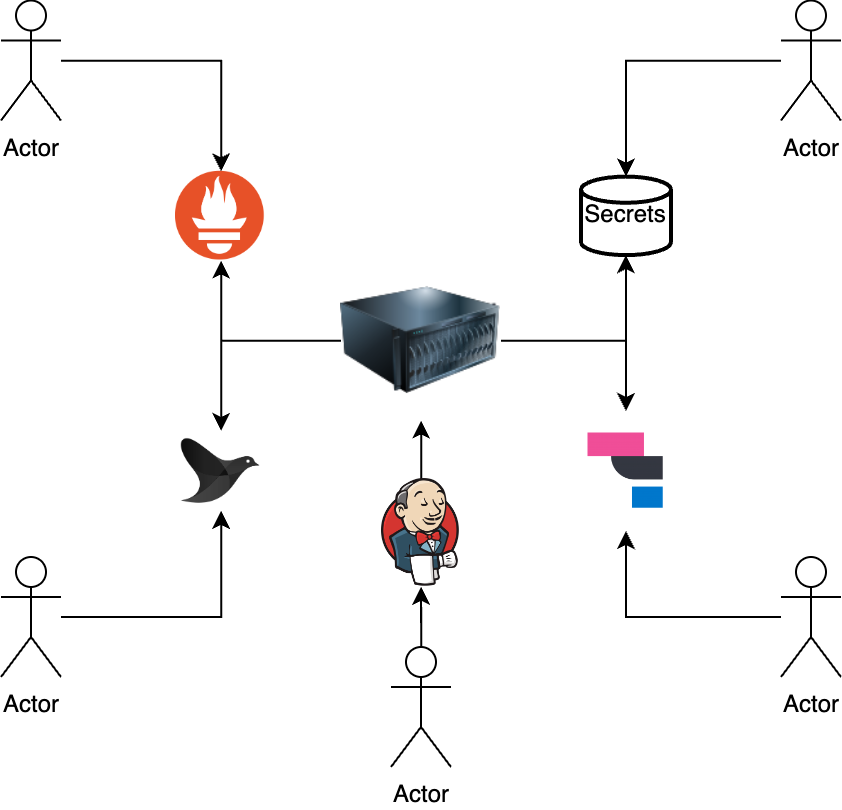
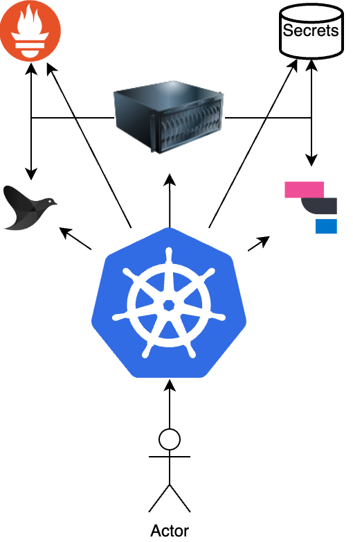

# **Introduction**

러닝스푼즈
Kubernetes Deep Dive - 1주차 - 2교시

---

## Q. 쿠버네티스를 한 문장으로 정의한다면?

(컨테이너 오케스트레이션 말고)

---

## Q. 쿠버네티스는 왜 쓸까요?

- SSH
- Ansible, Chef, Puppet
- Jenkins, CircleCI, Github Action

이 존재하는데?

---

## A. 쿠버네티스를 한 문장으로 정의한다면?

리소스 관리 도구

리소스의 정의: 이름을 붙힐 수 있고, text (yaml) 형태로 정의가 가능한 모든것

---

## A. 쿠버네티스는 왜 쓸까요?

통합된 리소스 관리 수단

Kubernetes API (=kubectl) 하나로 애플리케이션 배포뿐만 아니라, 로그-메트릭 / API Gateway / Service Mesh / HW Resource Allocation 등등 수많은 것들을 Kubernetes API라는 하나의 수단으로 관리.

각 팀, 프로젝트, 부서, 회사별로 다 제멋대로 구성했던 것을 하나의 방법으로 통일
-> 매번 새롭게 배워야 했던 것을 kubectl 명령어 한번 휙 쓰면 다 파악이 가능

---

---

# 목차

1. 쿠버네티스 이전의 세상
2. 쿠버네티스 란?
3. 컨테이너 없이 쿠버네티스 배포하기

---

## 쿠버네티스 이전의 세상

[PDF](./2.k8s101-history.pdf)

---

## 쿠버네티스 란?

Q. 그래서 쿠버네티스는 무엇인가요?
A. Container Orchestrator 라고 합니다.

---

## 쿠버네티스 란?

1. Google 에서 오픈소스로 공개한 프로젝트
2. 2003 ~ 4년 쯤 구글에서 시작한 Borg 라는 프로젝트를 오픈소스로 다시 만든 프로젝트

https://research.google/pubs/pub43438/

- Borg 는 C 로 만들어져 있고, K8s 는 Go 로 개발
- 컨셉과 목표는 공유하지만 완전 별개의 프로젝트
- 그럼에도 불구하고 K8s 가 처음 개발될 때 Borg 의 장단점이 반영되어있음

---

## Borg 의 장점

1. **hides the details** of resource management and failure handling so **its users can focus on application development instead**
2. operates with very high reliability and availability, and supports applications that do the same
3. lets us run **workloads across tens of thousands of machines effectively**

---

## Borg로부터 배운 것 (Bad)

1. Job (현재의 Pod) 개념만 만들었는데 각 부서에서 Annotation 정보를 이용해서 각자 mgmt 툴 만들어서 Progressive Delivery를 알아서 구현해서 쓰고 있더라 -> 이런 용도로 사용하기 위한 Label 개념의 탄생 (Deployment, StatefulSet)
2. IP 주소를 Machine마다 한 개씩 부여하는 것은 네트워크 문제가 많더라 -> Pod 별로 IP 주소를 할당
3. 기능을 너무 많이 주었더니 (yaml 필드를 너무 많이 만들었더니) 안쓰더라... -> 자동으로 설정 맞춰주는 서비스 개발

---

## Borg로부터 배운 것 (Good)

1. CPU / Memory Requests 와 Limits를 미리 지정해두게 하는 것은 유용했다.
2. Task(=Pod) 관리도 유용했지만 (Borg의 본래 목표)
   Naming (=Service), Loadbalancing (=ClusterIP) 도 만만치 않게 유용했다

---

## Borg로부터 배운 것 (Good)

- Although Borg almost always “just works,” **when something goes wrong, finding the root cause can be challenging.**
- An important design decision in Borg was to surface debugging information to all users rather than hiding it: Borg has thousands of users, so “self-help” has to be the first step in debugging.
- An important design decision in Borg was to **surface debugging information to all users rather than hiding it.**
  -> Kubernetes aims to replicate many of Borg’s introspection techniques. /~for example~/ cAdvisor, Elasticsearch, Kibana, Fluentd, Object Snapshot, Events

---

## Borg로부터 배운 것 (Good)

**The master is the kernel of a distributed system**

**Borgmaster** was originally designed as a **monolithic system**, but over time, **it became more of a kernel** sitting at the heart of an ecosystem of services that cooperate to manage user jobs. For example, we split off the scheduler and the primary UI (Sigma) into separate processes, and added services for admission control, vertical and horizontal autoscaling, re-packing tasks, periodic job submission (cron), workflow management, and archiving system actions for off-line querying. Together, these have allowed us to scale up the workload and feature set without sacrificing performance or maintainability.

---

## Borg로부터 배운 것 (Good)

The Kubernetes architecture goes further: it has an **API server** at its core that **is responsible only for processing requests and manipulating the underlying state objects.** The cluster management logic is built as small, composable micro-services that are clients of this API server, such as the replication controller, which maintains the desired number of replicas of a pod in the face of failures, and the node controller, which manages the machine lifecycle.

---

## Borg로부터 배운 것 (3줄 요약)

1. BorgMaster는 최초에는 Monolithic 했지만, 스케줄러와 UI를 시작으로 Autoscailing, Cron, Archiving System 등등을 분리했다.

2. Kubernetes는 더 MSA스럽게 만들었다. API 서버는 Object “만” 관리한다.

3. 클러스터 관리 로직은 별도의 마이크로 서비스(=컨트롤러)에서 돌아간다.

---

## 쿠버네티스 구성요소

## 

---

## 쿠버네티스 구성요소

**kube-apiserver** 를 중심으로 하는 중앙 집중형 구성

**kube-apiserver** 를 중심으로 클러스터 그 자체를 관리하는 `Control Plane` 과
사용자의 애플리케이션이 배포되고 실행되는 `Data Plane` 으로 구분

~~논리적인 구분이지, 물리적으로 구분하는 개념은 아님~~

---

## 쿠버네티스 구성요소 - `Control Plane`

5가지 바이너리 파일

1. kube-apiserver
2. etcd
3. kube-scheduler
4. controller manager
5. cloud controller manager

---

## 쿠버네티스 구성요소 - `Control Plane`

**kube-apiserver**

K8s 상 모든 컴포넌트와 통신하는 유일한 API 서버.
기본적으로 K8s 상 모든 컴포넌트는 `kube-apiserver` 에 의존성을 가짐

`OpenAPI 호환 HTTP 기반 API` / `json, yaml, protobuf 사용가능` / 리소스 관리에 초점 / `Authentication`, `Authorization`, `Validation`, `Versioning`, `Defaulting` 등의 과정을 거쳐 사용자가 선언한 리소스를 저장하고 가져옴

**Kubernetes 에서 다른 컴포넌트는 없으면 불편한것이지만,**
**`kube-apiserver` 는 없으면 작동을 안함**

---

## 쿠버네티스 구성요소 - `Control Plane`

**etcd**

일반적으로 api server 에는 DB 가 필요함. etcd 는 kube-apiserver 의 DB.
`etcd` 는 모든 Kubernetes 컴포넌트중 유일하게 Stateful 한 존재 (=scale out 이 어려운 존재)

기본적으로 Redis에서 GET, SET, MONITOR 기능만 구현된 KV Storage라고 이해하면 쉬움

---

## 쿠버네티스 구성요소 - `Control Plane`

CAP Theorem에서 CP (Consistency, Partition Tolerance)에 해당하는 시스템.

- Strong Consistency 가 보장되며 Split Brain 이슈로부터 자유롭지만
- Availability 가 희생되었으며 Quorum 이상의 노드가 살아있을 때만 Write 가 가능

TMI. etcd 는 인턴의 작품 [링크](https://kubernetespodcast.com/episode/095-etcd/)

---

## 쿠버네티스 구성요소 - `Control Plane`

`kube-apiserver` 와 `etcd` 만 있으면 Kubernetes 라고 부를 수 있는 최소한의 조건을 충족

-> 이따 실습에서 해볼 것입니다. :-)

예시:
[upbound.io](https://www.upbound.io/): `kube-apiserver` 만 managed 로 관리, Crossplane 으로 AWS, GCP, AKS 등의 클라우드 리소스 관리 (Terraform 대안품)

---

## 쿠버네티스 구성요소 - `Control Plane`

**kube-scheduler**

- kube-apiserver 를 WATCH 하다가 `spec.nodeName` 필드가 비어있는 Pod 이 발견되면 적당히 채워주는 컴포넌트
  -> 2주차

**controller manager**

- kube-apiserver 를 WATCH 하다가 40+ 개의 리소스에 대해서 적당한 Reconcile 로직을 수행해주는 컴포넌트
  -> 3주차

---

## 쿠버네티스 구성요소 - `Control Plane`

**cloud controller manager**

- kube-apiserver 를 WATCH 하다가 AWS, GCP, Azure 등 CSP 에 유효한 요청을 보내거나 반영하는 컴포넌트
  -> 5주차

---

## 쿠버네티스 구성요소

---

## 쿠버네티스 구성요소 - `Data Plane`

**kubelet**

- kube-apiserver 를 WATCH 하다가 `spec.nodeName` 이 자기자신인 Pod 이 발견되면 CRI 를 통해 컨테이너 프로세스를 실행해주는 컴포넌트
  -> 5주차

**kube-proxy**

- kube-apiserver 를 WATCH 하다가 Service 가 발견되면 iptables 혹은 IPVS 를 통해서 호스트 내부에서만 유효한 L4 SW LB 를 생성해주는 컴포넌트
  -> 4주차

---

# 질문
