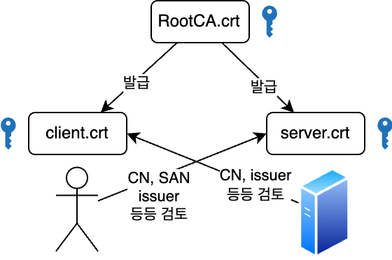
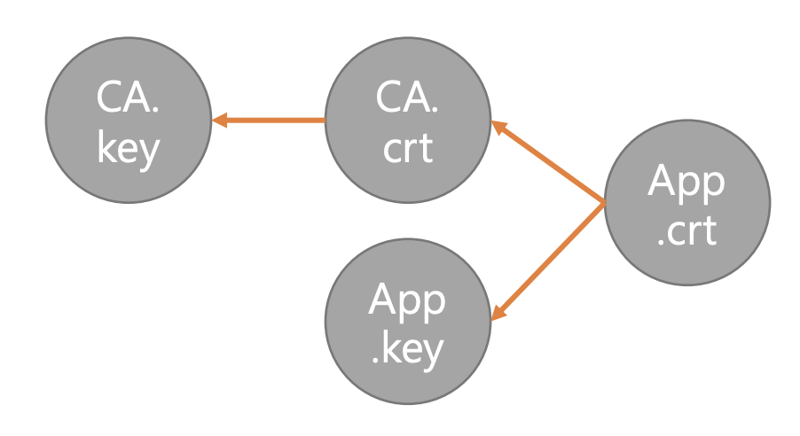

# **Introduction**

러닝스푼즈
Kubernetes Deep Dive - 1주차 - 3교시

---

## 실습: 컨테이너 없이 쿠버네티스 배포해보기

---

# 준비물

1. (편의상) docker 명령어가 실행되는 PC
2. ```bash
   git clone https://github.com/iwanhae/practice.git && cd practice/demo-1
   ```

---

# 인증서 만들기 (Hard Way)

**TLS**: TCP를 통한 통신을 안전하게 보호하기 위한 통신 규격

핵심: 클라이언트는 서버를 신뢰할 방법이 필요하다
(내가 접속을 시도하는 서버가 해커가 가로챈 서버가 아니라는 사실을 어떻게 증명할까?)

---

# 인증서 만들기 (Hard Way)

**Terminology**

**x509 cert**: metadata 와 public key 가 포함된 인증서를 기록하는 한가지 표준. `*.crt` 형태
**key**: cert 의 public key 와 쌍이되는 private key 가 포함된 파일. `*.key` 형태
**Root Certificate Authority (Root CA)**: 일단 믿고보는 기관. 보통 운영체제 설치할때 `/etc/ssl` 경로에 이 기관에서 발행한 x509 cert 가 이미 들어가 있다.
**Certificate chains**: 모든 인증서를 Root CA 에서 일일히 서명해줄수는 없으니 x509 스펙상 RootCA 가 보증한 Intermediate CA 가 서명한 인증서도 유효하다. 이를 Certificate chains 라고 부른다.

---

# 인증서 만들기 (Hard Way)

**TLS**

보안통신 규격. K8s 세상에서는 웹브라우져와 동일하게 x509 인증서를 통한 통신만 수행한다.

Example: `curl -v https://dev.iwanhae.kr`

x509 인증서를 통한 TLS 통신에서
클라이언트가 서버를 신뢰하기 위한 핵심이 되는 필드는 보통 Common Name(CN) 과 Subject Alternative Name (SAN)

---

# 인증서 만들기 (Hard Way)

**Mutual TLS (mTLS)**

클라이언트가 서버를 신뢰할 뿐 아니라, 서버도 클라이언트를 신뢰할 방법이 필요.

Example:

```bash
curl https://192.168.100.250:6443 -v \
  --cacert /etc/kubernetes/pki/ca.crt \
  --cert /etc/kubernetes/pki/apiserver-kubelet-client.crt \
  --key /etc/kubernetes/pki/apiserver-kubelet-client.key
```

---

# 질문

---

# 인증서 만들기 (Hard Way)



---

# 인증서 만들기 (Hard Way)

생성 순서

1. ca.key
2. ca.crt
3. server.key / client.key
4. server.crt / client.crt



---

# 인증서 만들기 (Hard Way)

https://github.com/iwanhae/practice/blob/main/demo-1/1.generating_certifications_hardway.md

---

# 질문

---

## 쿠버네티스 구성요소


---

# 인증서 만들기 (Easy Way)

https://github.com/iwanhae/practice/blob/main/demo-1/2.generating_certifications.md

---

# etcd 실행하기

https://github.com/iwanhae/practice/blob/main/demo-1/3.executing_etcd.md

---

# kube-apiserver 실행하기

https://github.com/iwanhae/practice/blob/main/demo-1/4.executing_kube_apiserver.md

---

# 질문

---

# kubectl 맛보기

https://github.com/iwanhae/practice/blob/main/demo-1/5.using_kubectl.md

---

# 질문

---

# Wrap-up

**쿠버네티스의 과거와 현재:**
SSH 시절부터 시작해 VM, Container 환경에 대해 진화를 거듭해오다 Container Orchestration 시장을 K8s 가 잡아먹었다.

**쿠버네티스란?:**
Borg에서 겪은 시행착오로부터 만들어진 여러 개의 컴포넌트들이 다 같이 돌아가는 MSA 를 따르는 프로젝트

**컨테이너 없이 쿠버네티스 배포:**
etcd, kube-apiserver만 배포해도 Kubernetes 는 동작한다

---

# Notice

1. 다음 주 수업은 Kubernetes API와 관련된 내용을 다룹니다.

- Kubernetes API 설계 / 스펙 보는법
- curl 로 조작하는 방법
- 인증 / 인가 / Admission Controller
- Custom Resource Definition 원리
- 등등

2. 시간상 전부 다루지는 못합니다. 관련해서 궁금한 내용을 **1월 10일 수요일 23시 59분까지 디스코드에** 남겨주세요. (질문 내용을 기반으로 PPT 변경 예정입니다.)
