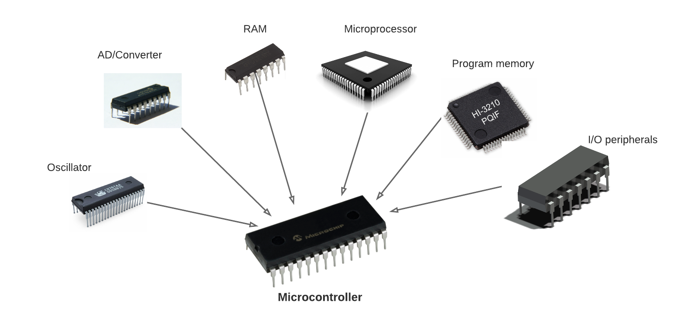

# **Kubernetes Controller**

러닝스푼즈
Kubernetes Deep Dive - 2주차 - 0교시

---

## 이번주 재미났던 소식

- https://blog.montkim.com/lxcfs
- https://github.com/vectordotdev/vector
- https://david-thoughts.notion.site/alertmanager-99c7c770dbc0417bb677266085789036

---

# Q. 저희 저번 시간에 뭐 했죠?

https://www.notion.so/ad8b35932a3b4d3d9f846077842f6687?v=67911e985f664268b67cfab76b8f0dab

---

# Q. 컨트롤러란 무엇인가요?

---

Gaming **Controller**

---

Micro **Controller**

---

**Controller**

---

# Q. 컨트롤러에 대해서 정의를 내려봅시다

---

# Q. 선언형 API 와 명령형 API 의 차이점은 무엇인가요?

---

# 오늘의 목표

1. 컨트롤러 패턴이랑 익숙해지기
2. 운영할 때 Pod 과 관련된 주의사항 숙지하기

---

# 목차

1. Controller Pattern
2. Custom Controller
3. Pod Lifecycle (실습)
