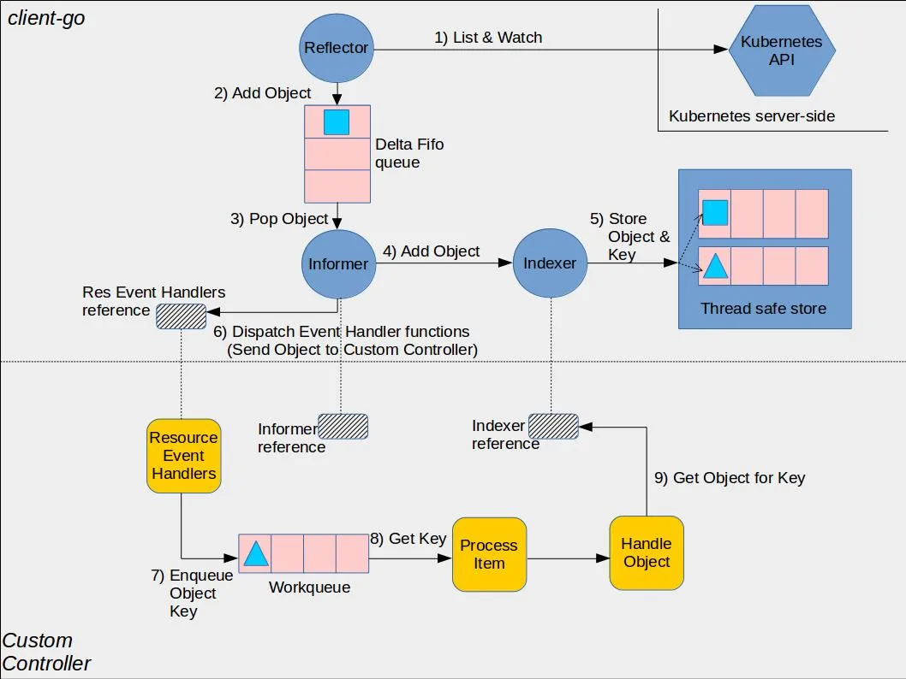

# **Kubernetes Controller**

러닝스푼즈
Kubernetes Deep Dive - 3주차 - 1교시

---

# 목차

1. Controller Pattern
   1-1. 선언형 API 와 Controller 패턴
   1-2. kube-controller-manager 의 예시
   1-2-1. Deployment
   1-2-2. StatefulSet
   1-2-3. DaemonSet

---

# 선언형 API 란?

기본적인 컨셉은

1. 내가 원하는 상태를 선언한다.
2. 시스템은 내가 원하는 상태로 맞춰준다.

- [Docker](https://docs.docker.com/engine/api/v1.43/) > 명령형
- [K8s](https://s3.iwanhae.kr/public/k8s/index.html) > 선언형

---

# 어떻게 "시스템은 내가 원하는 상태로 맞춰"줄까?

-> Controller Pattern

---

# 에어컨 컨트롤러

- Closed Loop System
- 기계공학에서는 허구한날 쓰는 용어
- 기계공학의 개념을 CS에서 빌려옴


---

# K8s Controller

[link](https://github.com/kubernetes/community/blob/master/contributors/devel/sig-api-machinery/controllers.md)

```go
for {
  desired := getDesiredState()
  current := getCurrentState()
  makeChanges(desired, current)
}
```

---

# 물론 현실은 저렇게 간단하진 않음 - 1

[link](https://cloudark.medium.com/kubernetes-custom-controllers-b6c7d0668fdf)

- 네트워크 트래픽을 줄이기위한 캐싱
- 동시성 이슈를 처리하기위한 큐잉



---

# 물론 현실은 저렇게 간단하진 않음 - 2

- `kubectl get leases.coordination.k8s.io`
- 동시간에 하나의 리소스를 조작하는건 최대 1개의 컨트롤러가 되게하기위한 lease api

---

K8s 의 **거의 대부분의** 요소는 기본적으로 컨트롤러 패턴을 따름

- `kubelet`: Pod 의 desiredState 보고 CRI 를 통해 컨테이너의 Current State 가 Desired State 와 같게 노력
- `kube-proxy`: Service 의 desiredState 를 보고 IPTables 와 IPVS 를 조작해 Current State 가 (이하생략)
- `cloud-controller-manager`: Node, Loadbalancer 등의 desiredState 보고 CSP API 찔러서 Current.. (이하생략)
- `kube-controller-manager`: 위와 같은 컨트롤러가 40개 넘게 돌아가는 컴포넌트

예외: `kube-shceduler`: Pod Spec 보고 Spec 을 업데이트 함 -> 이상하니깐 subresource 로 별도로 빼냄

---

# Q & A

---

# Q. kube-controller-manager 는 뭐하는 컴포넌트 같나요?

---

# kube-controller-manager

- 대충 40개가 넘어가는 컨트롤러들을 하나의 바이너리로 묶은 컴포넌트
- 문자 그대로의 의미로 우리가 쓰는 모든 K8s 에 기대되는 액션은 kube-controller-manager 가 해주는것
- 근데 문서화 안되어있음 / 자세히 알려면 코드를 뜯어보는 방법밖에...
- 그럼 이제 뜯어봅시다 😎

---

# kube-controller-manager 감잡기 - overview

https://github.com/kubernetes/kubernetes/tree/v1.27.4/cmd/kube-controller-manager/app

1. 다양한 컨트롤러가 존재
2. 각 컨트롤러는 어떤 리소스를 Watch 하고 있는가?
3. 컨트롤러들은 고루틴으로 병렬적으로 실행

---

# Deployment 개요

- [OpenShift](https://github.com/kubernetes/kubernetes/issues/1743#issuecomment-91431450) 에서 만들어진 개념이 K8s 에 적용된 사례
- 현재 K8s 에서 가장 기본적으로 가장 많이 사용되는 리소스
- Deployment > ReplicaSet > Pod
- ReplicaSet 과 별도로 존재하는 이유:
  - ReplicaSet 은 숫자 유지에 초점을 둠
  - Deployment 는 숫자 조절에 초점을 둠

---

# Deployment 코드

[src](https://github.com/kubernetes/kubernetes/blob/master/pkg/controller/deployment/deployment_controller.go#L64-L98) [types](https://github.com/kubernetes/kubernetes/blob/master/staging/src/k8s.io/api/apps/v1/types.go#L354-L369)

- 결국 `processNextWorkItem` > `syncDeployment` 로 귀결
- 기본적으로 ReplicaSet 만 조작
- 삭제로직은 없음 > Owner Reference 를 통한 GC 에 의존
- `EqualIgnoreHash(&rsList[i].Spec.Template, &deployment.Spec.Template)`

---

# Deployment 질문

Q. 노드 3개에 Replicas 가 99로 설정된 Deployment를 배포하면 Pod 은 어떻게 배포될까?
Q. ReadWriteOnce 특징을 가진 PV를 Deployment로 관리하면 어떻게 될까?
Q. Elasticsearch, etcd, ZooKeeper 를 Deployment 로 관리하기 까다로운 이유?

---

# StatefulSet 개요

- 본래 이름은 PetSet (Q. Pet의 반대되는 개념은?)
- 3개의 문제 제기에서 시작 [Link](https://github.com/kubernetes/kubernetes/issues/260)
- 3가지 특징
  1. 개별 Pod 을 특정하기 쉽게 네이밍
  2. 개별 Pod 과 연결하기 쉽게 DNS 주소 부여
  3. PVC 관리같이해줌

---

# StatefulSet 코드

[src](https://github.com/kubernetes/kubernetes/blob/v1.27.4/pkg/controller/statefulset/stateful_set.go#L52-L77) [types](https://github.com/kubernetes/kubernetes/blob/v1.27.4/staging/src/k8s.io/api/apps/v1/types.go#L40-L62)

- 똑같이, 결국 `processNextWorkItem` > `syncStatefulSet` 로 귀결
- StatefulSet 은 Pod 을 직접 조작

---

# StatefulSet 질문

Q. Pod 업데이트를 수동으로 하고 싶으면?
Q. 특정 노드에 특정 Pod 을 띄우고 싶으면? (e.g., 물리적으로 특정 노드에서만 PV 사용이 가능하다)
Q. 이미 생성한 PVC 볼륨 크기를 키우고 싶으면? ([ㅎ...](https://github.com/kubernetes/kubernetes/issues/68737))

---

# DaemonSet 개요

- 로그수집하거나 하나의 노드에 하나의 서버만 띄우는 (HDFS) 요구사항으로 나온 컨셉 [link](https://github.com/kubernetes/kubernetes/issues/1518)
- 실제 Production에서 의외로 StatefulSet 과 고민하는 경우가 종종 있음
- 로그 & 메트릭 / 네트워킹 / 스토리지 에이전트 용도로 자주 사용

---

# DaemonSet 코드

[src](https://github.com/kubernetes/kubernetes/blob/v1.27.4/pkg/controller/daemon/daemon_controller.go) [types](https://github.com/kubernetes/kubernetes/blob/v1.27.4/staging/src/k8s.io/api/apps/v1/types.go#L40-L62)

- Pod 생성 시부터 nodeName 을 지정해서 생성하는 것이 특징 (kube-scheduler 영향 X) [link](https://github.com/kubernetes/kubernetes/blob/v1.27.4/pkg/controller/daemon/daemon_controller.go#L1351)
- StatefulSet 과 비슷하게 `RollingUpdate` 과 `OnDelete` 두가지가 존재
- Taint 도 이곳에서 처리 [link](https://github.com/kubernetes/kubernetes/blob/v1.27.4/pkg/controller/daemon/daemon_controller.go#L1318) (kubelet 쪽에서는 Taint / Tolerant 검증 안함)

---

# DaemonSet 질문

Q. 어디다 쓰면 좋을까요?
Q. `ingress-nginx` 랑 같이 써보는거 어떻게 생각하세요?
Q. `kubectl rollout restart` 는 어떻게 작동하나요?

---

# Q & A
