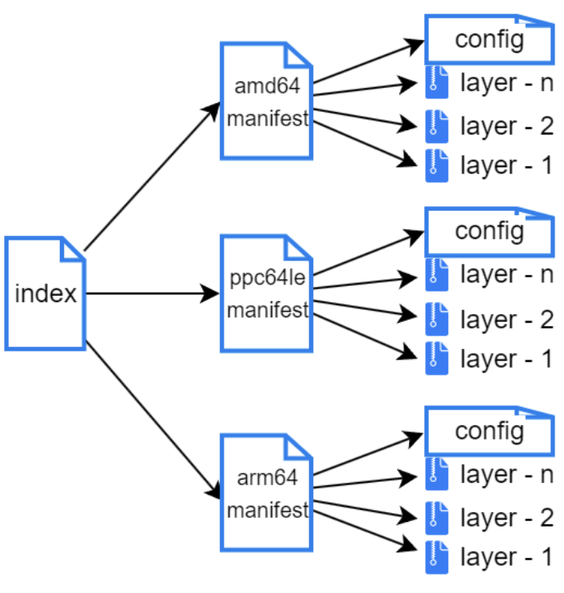

# **Kubernetes Interfaces**

러닝스푼즈
Kubernetes Deep Dive - 5주차 - 2

---

# 목차

0. 서론
1. Interface 란?
2. **Open Container Initiative**
3. CNCF

---

# Open Container Initiative (OCI) 란?

- 컨테이너에 대한 표준 규약을 만들기 위해 시작된 "프로젝트"
- Linux Foundation 을 주축으로 우리가 아는 대부분의 기업이 멤버로 참여
- Docker에서 사용한 스펙을 베이스로 개선사항이 포함되어 있음

---

# 컨테이너를 실행한다는 것은?

(`docker run nginx` 했을 때 발생하는 일은?)

---

# 컨테이너를 실행한다는 것은?

(`docker run nginx` 했을 때 발생하는 일은?)

1. Registry에서 컨테이너 이미지를 다운로드한다는 것

---

# 컨테이너를 실행한다는 것은?

(`docker run nginx` 했을 때 발생하는 일은?)

1. Registry에서 컨테이너 이미지를 다운로드한다는 것
2. 다운로드한 이미지를 로컬 어딘가에 파일 시스템으로 만든다는 것

---

# 컨테이너를 실행한다는 것은?

(`docker run nginx` 했을 때 발생하는 일은?)

1. Registry에서 컨테이너 이미지를 다운로드한다는 것
2. 다운로드한 이미지를 로컬 어딘가에 파일 시스템으로 만든다는 것
3. 파일시스템을 기반으로 특정 프로세스를 실행한다는 것

---

# 데모

`week-5/chroot`

---

# OCI Interface

딱 3개의 Spec 을 발표
https://specs.opencontainers.org/

- Runtime Spec
- Image Spec
- Dustribution Spec

---

# Runtime Spec

로컬에서 컨테이너를 어떻게

- 만들고
- 모니터링하고
- 관리하고
- 삭제

할 것인지에 대한 스펙. (단, 어떻게 만들지는 제약이 없다. WASM, VM, Container 무엇을 사용해도 규격에는 적합)

---

# Runtime Spec

- Runtime Spec 은 CLI 형태로 어떤 커맨드가 어떻게 작동해야 하는지 기술
- 상태는 어디에 어떤 포맷으로 저장하는지에 대한 스펙이 기술되어있다.
  - 특정 디렉토리를 기준으로 json 형태로 컨테이너의 실행상태를 저장
- 대표적인 구현체:
  - https://github.com/opencontainers/runtime-spec/blob/main/implementations.md
  - runc
  - gvisor

---

# Demo

아래는 docker 가 runc 를 사용하는 경로 (conifg 로 변경 가능)

```bash
# Docker Default
runc --root /run/docker/runtime-runc/moby  list

# Containerd Default
runc --root /run/containerd/runc/{namespace}  list
```

---

# Image Spec

- Image Spec 은 Runtime Spec 에서 사용하는 RootFS 을
  - 어떻게 저장하고
  - 어떻게 사용하는지
- 에 대한 내용들이 기술
- 구버전 Docker 이미지와 호환성 이슈가 있는 경우가 존재해서 뭔가 예상대로 돌아가지 않는다면
  - OCI 스펙인지
  - Docker 스펙인지
    확인해야함

---



---

# Image Spec

- 하나의 이미지에는
  - index [JSON] [Optional]
  - manifest [JSON]
    -> config [JSON]
    -> layers [TAR]
- 4가지 종류의 데이터가 존재

---

# Image Spec - Index

- 특정 아키텍처에서 돌아가기 위한 manifest 를 찾기위한 인덱스
- https://specs.opencontainers.org/image-spec/image-index/?v=v1.0.1
- https://dailychat.io/conversation/72710372-44dc-4c18-8ef7-4abd5a7cb75e

---

# Image Spec - Manifest

- 특정 이미지를 조립하기 위한 정보가 담겨있는곳
- https://specs.opencontainers.org/image-spec/manifest/?v=v1.0.1

---

# Image Spec - Config

- 이 이미지를 실행하기 위한 방법이 기술
- 이 이미지에 대한 메타데이터들이 기술
- https://specs.opencontainers.org/image-spec/config/?v=v1.0.1

# Image Spec - Layers

- 이 이미지의 실제 데이터
- https://specs.opencontainers.org/image-spec/layer/?v=v1.0.1

---

# 데모

- https://minio.iwanhae.kr/browser/registry/aWRvY2svZG9ja2VyL3JlZ2lzdHJ5L3YyLw==

---

# Q&A

---

# Distribution Spec

- 존재하는 이미지를 어떻게 배포할것인지에 대한 스펙
- 앞서 보았던 내용을 HTTP 기반의 API 로 배포하는 방법에 대해 기술
- https://specs.opencontainers.org/distribution-spec/?v=v1.0.0
- 다행스럽게도 스펙 그 자체에 대해서는 잘 몰라도 크게 지장은 없으나...

---

# !Distribution Spec

- Distribution Spec 에서 다루는 내용은 제한적. 세부적인 구현 방법에 대해서는 열려있음
- 구현체에따라 실제 트래픽이 어떻게 달라질 수 있고
- 인증과 인가에 대해서는 신경써두면 좋음

---

# DEMO

```bash
# Auth
export TOKEN=\
"$(curl --silent --header 'GET' "https://auth.docker.io/token?service=registry.docker.io&scope=repository:library/ubuntu:pull" | jq -r '.token' )"

# Tag List
curl -H "Authorization: Bearer $TOKEN"\
     https://registry.hub.docker.com/v2/library/ubuntu/tags/list

# Index
curl -H "Authorization: Bearer $TOKEN"\
     -H "Accept: application/vnd.oci.image.index.v1+json"\
     https://registry.hub.docker.com/v2/library/ubuntu/manifests/latest

# Manifest
curl -H "Authorization: Bearer $TOKEN"\
     -H "Accept: application/vnd.oci.image.manifest.v1+json"\
     https://registry.hub.docker.com/v2/library/ubuntu/manifests/sha256:bcc511d82482900604524a8e8d64bf4c53b2461868dac55f4d04d660e61983cb

# Blobs
curl -H "Authorization: Bearer $TOKEN"\
      https://registry.hub.docker.com/v2/library/ubuntu/blobs/sha256:57c139bbda7eb92a286d974aa8fef81acf1a8cbc742242619252c13b196ab499

# https://www.cloudflare.com/ko-kr/case-studies/docker/
```

---

# NGINX

```bash

export TOKEN=\
"$(curl --silent --header 'GET' "https://auth.docker.io/token?service=registry.docker.io&scope=repository:library/nginx:pull" | jq -r '.token' )"

# Tag List
curl -H "Authorization: Bearer $TOKEN"\
     https://registry.hub.docker.com/v2/library/nginx/tags/list

# Index
curl -H "Authorization: Bearer $TOKEN"\
     https://registry.hub.docker.com/v2/library/nginx/manifests/1.23

# Index
curl -H "Authorization: Bearer $TOKEN"\
     https://registry.hub.docker.com/v2/library/nginx/manifests/1.24

```

---

# Q&A

---

# 인증 / 인가

- 기본적으로 Authorzation Header 기반 Token 인증
- 아래 설정이 실질적인 표준처럼 적용됨.
  - https://github.com/containers/image/blob/main/docs/containers-auth.json.5.md
- **다만 이 토큰을 어떻게 얻는지는 방법이 다양**
- https://github.com/distribution/distribution/blob/main/docs/spec/auth/index.md

---
