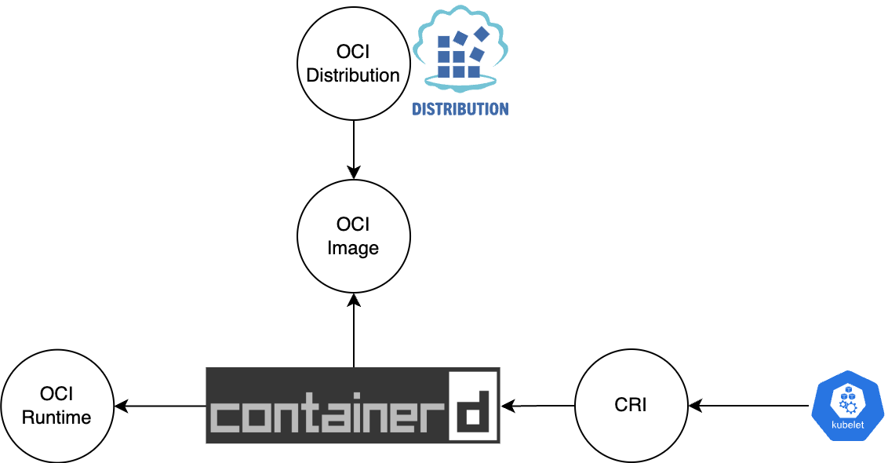
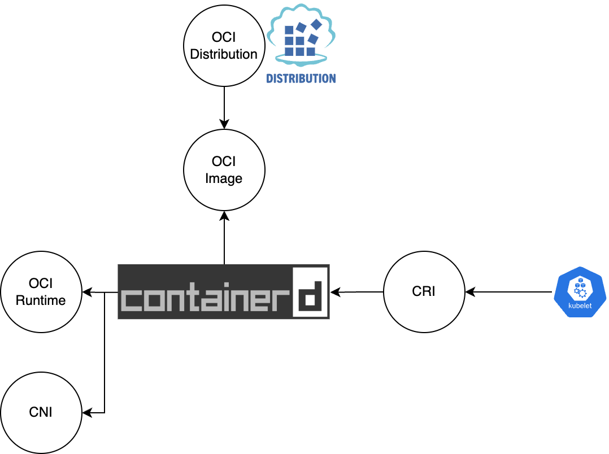
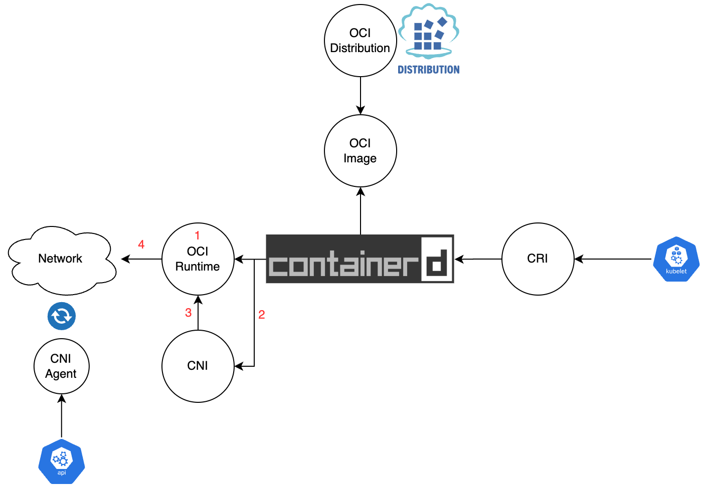
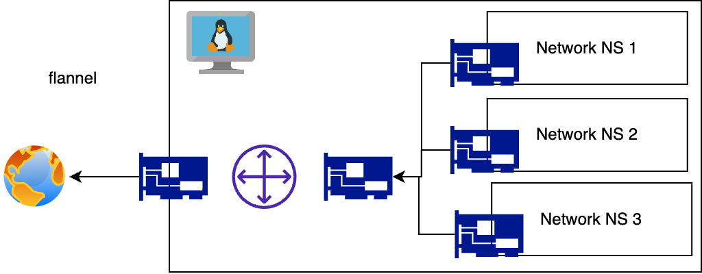
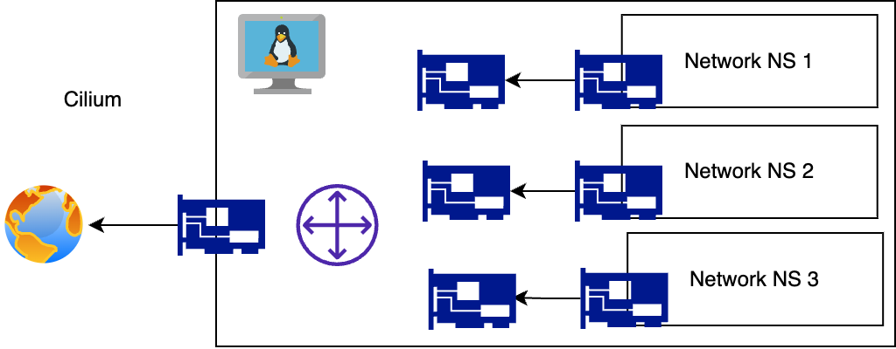

# **Kubernetes Interfaces**

러닝스푼즈
Kubernetes Deep Dive - 5주차 - 3

---

# 목차

0. 서론
1. Interface 란?
2. Open Container Initiative
3. **CNCF**

---

# CNCF 란?

- Cloud Native Computing Foundation
- Linux Foundation 에서 만든 비영리단체
- 다양한 오픈소스 프로젝트들을 후원하면서 지금의 클라우드 생태계를 조성함

---

# OCI 에서 정의한 스펙은?

- 매우 낮은 레벨에서의 컨테이너 실행 방법에 대한 정의
- 실제 프로덕션에서 사용하기에는 빠진것이 많음
  - 네트워크
  - 컨테이너 이미지 관리
  - 스토리지
  - 노드 / 로드밸런서

---

# CNCF 에서 정의한 인터페이스는?

- 매우 낮은 레벨에서의 컨테이너 실행 방법에 대한 정의
- 실제 프로덕션에서 사용하기에는 빠진것이 많음
  - 네트워크 -> CRI / CNI
  - 컨테이너 이미지 관리 -> CRI
  - 스토리지 -> CSI
  - 노드 / 로드밸런서 -> CPI

---

# CNCF 에서 정의한 인터페이스는?

스펙보다는 인터페이스

Kubernetes 의 책임범위와
Kubernetes 의 외부 프로젝트의 책임범위를 명확하게 하는 성격이 강함.

물론 다양한 환경을 지원하려는 의도도 존재.

- 같은 containerd 를 사용하더라도
  - NUMA, Netowrk Offloading (5G), NVMe/TCP, GPU, TPU 등등...
    하드웨어가 끼기 시작하면 매우 복잡해짐

---

# CNCF 에서 정의한 인터페이스는?

- CRI: Container Runtime Interface
  주로 kubelet 이 UDS 를 사용해 gRPC 로 소통
- CNI: Container Network Interface
  주로 CRI 구현체가 커맨드를 실행하는 방식으로 소통
- CSI: Container Storage Interface
  주로 CSI Controller 가 UDS 로 CSI 구현체와 소통
- CPI: Cloud Provider Interface
  클라우드 공급업체가 많아지다보니깐 표준 컨트롤러 규격을 개발
  구현체는 코드레벨로 결합

---

# CRI

Container Runtime Interface

- [protobuf](https://github.com/kubernetes/cri-api/blob/master/pkg/apis/runtime/v1/api.proto)
- [first release](https://github.com/kubernetes/kubernetes/blob/242a97307b34076d5d8f5bbeb154fa4d97c9ef1d/docs/devel/container-runtime-interface.md)
- [TMI](https://dailychat.io/conversation/313f0a52-600f-4d20-8c24-e12c247d90cb)

---

# CRI

Container Runtime Interface

- 다양한 구현체들이 존재하지만... 대부분은 이 두개중 하나만 사용
  - containerd
    Docker 가 OCI 규격 맞추면서 분리된 더 Low Level 의 Runtime 구현체
    Docker: Runtime, Volume, Build, Network
  - cri-o

---

# CRI

- `kubelet` 에서 gRPC 로 호출
- Continaer 의 Lifecycle 을 관리
- 구체적으로는
  - Runtime Service
  - Image Service
- 가 존재

---

# CRI - Runtime Service

[protobuf](https://github.com/kubernetes/cri-api/blob/master/pkg/apis/runtime/v1/api.proto)

- PodSandbox 와 Container 개념이 분리
- PodSandbox를 생성해서 Pod의 IP 주소 등을 할당받은 다음에
- Container를 PodSandbox 안에서 실행시키는 개념
- 그 외에 잡다한 기능 (Log, Exec) 들도 구현
  (kubectl logs 명령어를 수행하면 `사용자` > `kube-apiserver` > `kubelet` > `CRI` > `containerd` > `Linuxe /var/log`)
- 의외로 메트릭을 볼 수 있는 방법이 없음 [참고](https://github.com/kubernetes/enhancements/issues/2371)

---

# CRI - Image Service

[protobuf](https://github.com/kubernetes/cri-api/blob/master/pkg/apis/runtime/v1/api.proto)

- 특정 노드의 Contianer Image 를 관리하는 서비스
- 이미지를 (Crednetial 과 함께) Pull 하는것부터 **삭제**까지 다방면으로 관리
- kubelet 은 전체 디스크의 80% 가 점유되면 미사용 컨테이너 이미지를 제거하는데 이 API 를 사용

---

# CRI - Demo

https://cloud.iwanhae.kr

- `crictl`

---

# Q&A

---

# CNI

- OCI 는 로컬에서 컨테이너를 만드는것에만 초점
- CRI 는 여러 컨테이너를 Pod 의 형태로 관리하는것에만 초점
- 네트워크는 누가 구성해...?

---

---

# CNI

- Container Network Interface https://www.cni.dev/
- runc 처럼 커맨드로 작동하는 내용이 기술된 표준
- 더 디테일한건 영상 참고: https://youtu.be/zChkx-AB5Xc?t=1450
- CNI의 근본적인 역할은 특정 네트워크 네임스페이스에 특정 인터페이스를 추가하는것

---

---

---

# CNI - Example

https://github.com/flannel-io/flannel

- Volume Mount
- Containerd Config
- Binaries

---

# Q&A

---

# CSI

Container Storage Interface

- https://github.com/kubernetes/kubernetes/blob/master/staging/src/k8s.io/api/core/v1/types.go#L47-L184
- 이렇게 계속 늘어나는거 보기 싫어서 탄생한 인터페이스

- 정의자체는 gRPC 스펙. Kubernetes 말고도 다양한 Continaer Orchestrator 가 사용하는걸 목표로 했으나... Kubernetes 말고 다 사라짐.
- https://github.com/container-storage-interface/spec/blob/master/spec.md#rpc-interface

---

# CSI

2.4.1. external-attacher
2.4.2. external-provisioner
2.4.3. external-resizer
2.4.4. external-snapshotter
2.4.5. livenessprobe
2.4.6. node-driver-registrar
2.4.7. cluster-driver-registrar
2.4.8. external-health-monitor-controller
2.4.9. external-health-monitor-agent

---

# CSI

2.4.1. external-attacher > remote storage 를 노드에 붙히고
2.4.2. external-provisioner > PVC 보고 있다가 PV 만들고
2.4.3. external-resizer > 용량 바뀌면 볼륨 크기 조절해주고
2.4.4. external-snapshotter > 백업 이미지 만들어두고
2.4.5. livenessprobe
2.4.6. node-driver-registrar > kubelet 에 볼륨 플러그인등록하고
2.4.7. cluster-driver-registrar > CSIDriver 리소스 업데이트하고
2.4.8. external-health-monitor-controller
2.4.9. external-health-monitor-agent

---

# CSI - Demo

1. 노드에서 볼륨보기
2. PV, PVC, SC, CSIDriver, CSINode, volumeattachments

---

# Q&A

---

# CPI

1. https://github.com/kubernetes/cloud-provider/blob/master/cloud.go#L42-L69

---

# SMI(외전): Service Mesh Interface

CRD 형태로 서비스메시에 대한 표준 Kubernetes API 를 추구
https://smi-spec.io/
